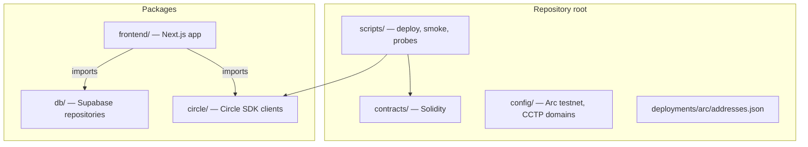
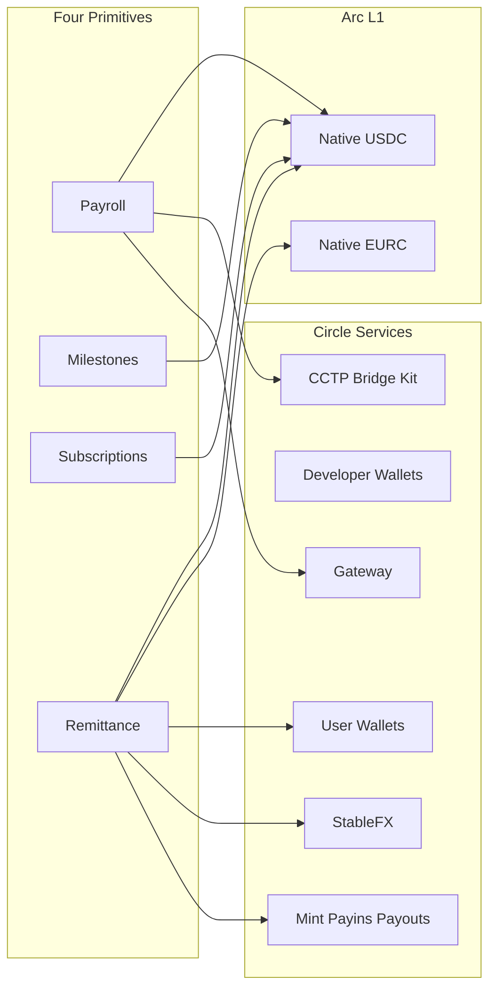
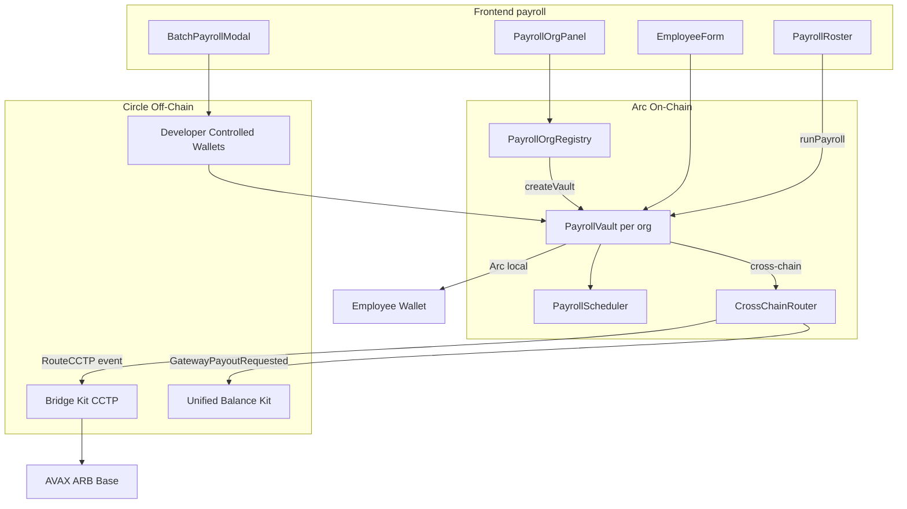
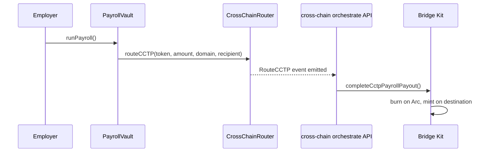
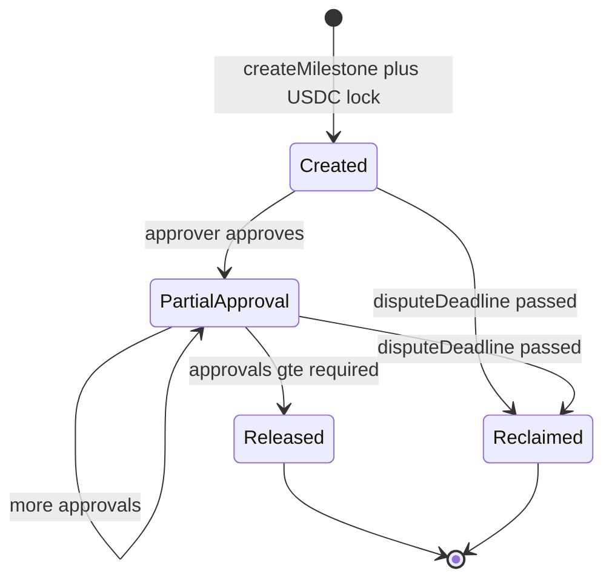
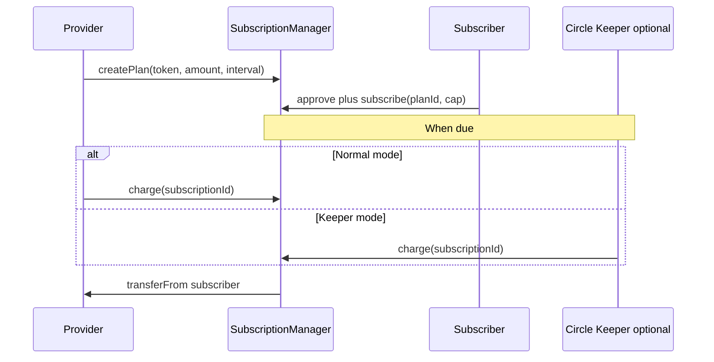
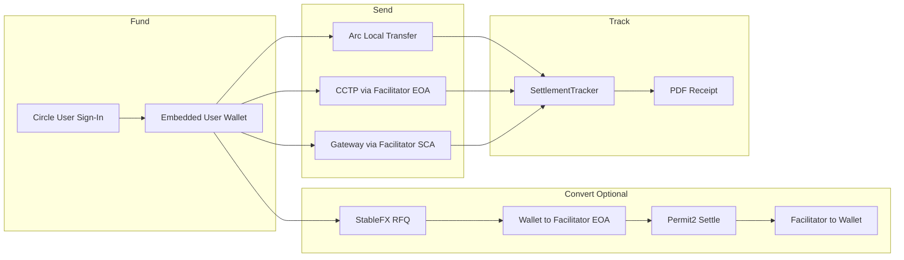
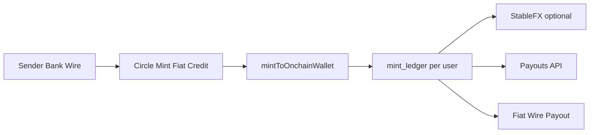
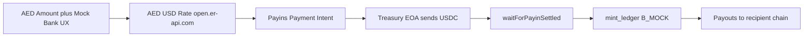

# Arcittance — Programmable Payments on Arc

**Arcittance** is a unified payment stack built on [Circle's Arc L1](https://www.circle.com/en/arc) testnet (chain ID `5042002`, CCTP domain `26`). It delivers four composable on-chain primitives — **payroll**, **milestone escrow**, **subscriptions**, and **consumer remittance** — all settling in native **USDC** and **EURC**. Gas on Arc is paid in USDC; there are no wrapped tokens or synthetic settlement rails.

The platform integrates deeply with Circle's product suite: **User Wallets (W3S)**, **Developer Controlled Wallets**, **Mint**, **Payins**, **Payouts**, **StableFX**, **CCTP / Bridge Kit**, and **Gateway / Unified Balance Kit**. Off-chain orchestrators complete cross-chain burns, unified-balance spends, and FX settlement legs that smart contracts alone cannot finish. Every remittance is tracked leg-by-leg with downloadable PDF receipts.

Arcittance is designed for judges, developers, and the Circle team who want to see programmable stablecoin payments — from employer payroll runs to AED corridor remittance demos — on a purpose-built stablecoin L1.

---

## Important Links

| Live App | Demo Video | Pitch Deck |
|----------|------------|------------|
| [arcittance.vercel.app](https://arcittance.vercel.app/) | TBD | TBD |

**Repository:** [github.com/Marshal-AM/arcittance](https://github.com/Marshal-AM/arcittance)

---

## Deployed Contracts (Arc Testnet)

All contracts are deployed on Arc testnet. Explorer: [testnet.arcscan.app](https://testnet.arcscan.app).

| Contract | Arcscan |
|----------|---------|
| PayrollOrgRegistry | [0x729a51BB90A72f628225Ca6a7583be51C7D5a2E5](https://testnet.arcscan.app/address/0x729a51BB90A72f628225Ca6a7583be51C7D5a2E5) |
| PayrollScheduler | [0x4292f03Db3716A5Ed44974DD3e5564f26b8359C1](https://testnet.arcscan.app/address/0x4292f03Db3716A5Ed44974DD3e5564f26b8359C1) |
| CrossChainRouter | [0xd582C4173aff5c04F64EAD42c4E12f3e5f93595d](https://testnet.arcscan.app/address/0xd582C4173aff5c04F64EAD42c4E12f3e5f93595d) |
| ConditionalEscrow | [0xEe618c3E0855c820eD02F10A3bDA876991120e4b](https://testnet.arcscan.app/address/0xEe618c3E0855c820eD02F10A3bDA876991120e4b) |
| SubscriptionManager | [0x2cC1fF23af1CFD0531AC568B7cAC709De1aE6de0](https://testnet.arcscan.app/address/0x2cC1fF23af1CFD0531AC568B7cAC709De1aE6de0) |
| RemittanceVault | [0x1A3c1901449C8aEF0c5e23a68d68F910EE607875](https://testnet.arcscan.app/address/0x1A3c1901449C8aEF0c5e23a68d68F910EE607875) |
| FXSettlementEscrow | [0xE02800F2BEAC8675EbBd7d23F795C62288085987](https://testnet.arcscan.app/address/0xE02800F2BEAC8675EbBd7d23F795C62288085987) |
| USDC (native) | [0x3600000000000000000000000000000000000000](https://testnet.arcscan.app/address/0x3600000000000000000000000000000000000000) |
| EURC | [0x89B50855Aa3bE2F677cD6303Cec089B5F319D72a](https://testnet.arcscan.app/address/0x89B50855Aa3bE2F677cD6303Cec089B5F319D72a) |
| CCTP TokenMessenger V2 | [0x8FE6B999Dc680CcFDD5Bf7EB0974218be2542DAA](https://testnet.arcscan.app/address/0x8FE6B999Dc680CcFDD5Bf7EB0974218be2542DAA) |

> **Note:** `PayrollVault` contracts are **not** in this table. Each organisation deploys its own vault via `PayrollOrgRegistry.createVault(orgId)`. See [Contracts on Arc](#contracts-on-arc).

Source of truth: [`deployments/arc/addresses.json`](deployments/arc/addresses.json) (deployed 2026-08-08).

---

## Table of Contents

- [Introduction](#introduction)
- [The Problem](#the-problem)
- [The Solution (Arcittance)](#the-solution-arcittance)
- [Payroll](#payroll)
  - [Org and Vault Factory Pattern](#org-and-vault-factory-pattern)
  - [Employee Roster and Scheduling](#employee-roster-and-scheduling)
  - [Arc-Local vs Cross-Chain Payout](#arc-local-vs-cross-chain-payout)
  - [Circle Keeper and Gas Sponsorship](#circle-keeper-and-gas-sponsorship)
  - [Post-Payroll CCTP Orchestration](#post-payroll-cctp-orchestration)
- [Milestones (Conditional Escrow)](#milestones-conditional-escrow)
  - [On-Chain Lifecycle](#on-chain-lifecycle)
  - [Approver Governance](#approver-governance)
  - [Keeper-Assisted Creation](#keeper-assisted-creation)
  - [Metadata and Tracking](#metadata-and-tracking)
- [Subscriptions](#subscriptions)
  - [Plans and Subscriber Caps](#plans-and-subscriber-caps)
  - [Charge Lifecycle](#charge-lifecycle)
  - [Batch Billing (Marketplace)](#batch-billing-marketplace)
- [Remittance](#remittance)
  - [Crypto-Native Remittance (Path A)](#crypto-native-remittance-path-a)
  - [Bank-Based Remittance (Path B)](#bank-based-remittance-path-b)
  - [Path B Sandbox Blocker (Circle Wire API)](#path-b-sandbox-blocker-circle-wire-api)
  - [Bank Remittance Mock (Path B Mock)](#bank-remittance-mock-path-b-mock)
- [Circle Integrations](#circle-integrations)
- [Contracts on Arc](#contracts-on-arc)
- [Feedback for Circle Team](#feedback-for-circle-team)
- [How to Setup the Project](#how-to-setup-the-project)
  - [Prerequisites](#prerequisites)
  - [Clone and Install](#clone-and-install)
  - [Environment Variables](#environment-variables)
  - [Wallet Provisioning and Faucet](#wallet-provisioning-and-faucet)
  - [Circle Console Setup](#circle-console-setup)
  - [Contract Addresses](#contract-addresses)
  - [Supabase and Database Migrations](#supabase-and-database-migrations)
  - [Run the Frontend](#run-the-frontend)
  - [Optional — Deploy and Configure Scripts](#optional--deploy-and-configure-scripts)
  - [Verify Your Setup](#verify-your-setup)
  - [Feature-Specific Requirements](#feature-specific-requirements)
  - [Troubleshooting](#troubleshooting)
- [Conclusion](#conclusion)
- [Appendix A — API Route Index](#appendix-a--api-route-index)
- [Appendix B — Environment Variable Reference](#appendix-b--environment-variable-reference)
- [Appendix C — Testing and Verification Commands](#appendix-c--testing-and-verification-commands)

---

## Introduction

Arcittance is a **programmable payments platform** on Circle's Arc testnet. It combines four payment primitives under one USDC/EURC settlement layer:

| Primitive | Route | On-chain core |
|-----------|-------|---------------|
| Payroll | `/payroll` | `PayrollOrgRegistry` + per-org `PayrollVault` |
| Milestones | `/escrow` | `ConditionalEscrow` |
| Subscriptions | `/subscriptions` | `SubscriptionManager` |
| Remittance | `/remit` | Circle Wallets + Mint/Payins/Payouts + optional `RemittanceVault` |

### Tech stack

| Layer | Technology |
|-------|------------|
| Smart contracts | Solidity 0.8.30, Hardhat, OpenZeppelin |
| Frontend | Next.js 15, React 19, Wagmi/Viem, Tailwind CSS |
| Circle SDK layer | Standalone `circle/` TypeScript package |
| Persistence | Supabase (Postgres) via `db/` repositories |
| Cross-chain | CCTP V2 + Bridge Kit, Gateway + Unified Balance Kit |
| Network | Arc testnet — chain ID `5042002`, RPC `https://rpc.testnet.arc.io` |

### Repository layout



| Directory | Purpose |
|-----------|---------|
| `contracts/` | All production Solidity contracts and interfaces |
| `frontend/` | Next.js UI, API routes, hooks, components |
| `circle/src/` | Canonical Circle integration (testable in isolation) |
| `frontend/lib/circle/` | Thin re-exports into `circle/src/` for Next.js |
| `db/` | Supabase client and repository layer |
| `config/` | Arc testnet constants, CCTP destination mapping |
| `deployments/arc/` | Deployed contract address registry |
| `scripts/` | Deploy, provision, smoke tests, wire probes |

### Platform overview



---

## The Problem

Cross-border money movement today is slow, expensive, and fragmented.

### Correspondent banking is costly and slow

Traditional SWIFT and correspondent-bank rails charge roughly **2–5%** in FX and transfer fees and take **3–5 business days** to settle. Arcittance's UI compares this directly against on-Arc settlement (~0.25% protocol fee, ~20 second settlement) via `ComparisonStrip` and [`frontend/lib/fees.ts`](frontend/lib/fees.ts):

| Metric | Traditional bank | Arcittance on Arc |
|--------|------------------|-------------------|
| Transfer fee | ~2.5% (250 bps midpoint) | ~0.25% (25 bps) |
| Settlement time | ~4 days | ~20 seconds |
| Gas currency | N/A (fiat) | USDC (native on Arc) |

### Tooling is siloed

Payroll lives in HRIS systems. Escrow lives in legal workflows. Subscriptions live in Stripe-like billing. Remittance lives in consumer apps. None of these share:

- A common settlement asset (USDC/EURC)
- Programmable on-chain rules (caps, schedules, multi-approver release)
- Cross-chain delivery (CCTP, Gateway)
- Live leg-by-leg tracking with auditable receipts

### Stablecoin infrastructure lacks programmable primitives

USDC exists on many chains, but employers, marketplaces, and remittance senders need **composable payment logic** — salary caps, recurring charge ceilings, milestone approval thresholds, dispute deadlines — enforced on-chain rather than in opaque backend databases. Arc provides the L1; Arcittance provides the application layer.

---

## The Solution (Arcittance)

Arcittance is **one payment engine, four rails**, all sharing:

1. **Native USDC/EURC on Arc** — no wrapped tokens
2. **Circle Wallets** — embedded user wallets for remittance; developer wallets for keeper/gas sponsorship
3. **Cross-chain routing** — CCTP point-to-point burn/mint or Gateway unified-balance spend
4. **StableFX** — live USDC↔EURC RFQ with Permit2 on-chain settlement
5. **Dual-rail remittance** — crypto-native (Path A), bank-intent (Path B), and mock AED corridor (Path B Mock)
6. **Off-chain orchestration** — `circle/src/*-orchestrator.ts` completes CCTP/Gateway/StableFX legs after on-chain events
7. **Persistence** — Supabase stores remittances, FX quotes, payins, payouts, mint ledger, and metadata

### End-to-end workflow (all features)

Every payment flow follows the same four-step mental model shown on the landing page:

| Step | Action | Examples |
|------|--------|----------|
| 01 Fund | Deposit USDC into vault, wallet, or bank rail | Vault deposit, Circle wallet, Mint wire, Payins |
| 02 Route | Choose Arc-local, CCTP, or Gateway | Employee destination chain, remit recipient chain |
| 03 Convert | Optional StableFX USDC↔EURC | Remit convert step |
| 04 Deliver | Payout to wallet or bank; track legs; download receipt | Payouts API, on-chain transfer, PDF receipt |

### What is demo-ready today

| Feature | Status |
|---------|--------|
| Payroll (Arc-local) | Fully working |
| Payroll (cross-chain CCTP/Gateway) | Working with orchestrator |
| Milestones | Fully working |
| Subscriptions | Fully working |
| Remit Path A (wallet + CCTP/Gateway) | Fully working |
| Remit Path B (bank wire → Mint) | **Blocked** — sandbox wire API (see Feedback) |
| Remit Path B Mock (AED corridor) | Fully working |

---

## Payroll

Payroll on Arcittance lets an employer create an on-chain organisation, deploy a dedicated vault, fund it with USDC, register employees with salary schedules and cross-chain routing preferences, and execute payroll runs — either locally on Arc or cross-chain via CCTP/Gateway.

### Architecture



### Org and Vault Factory Pattern

`PayrollOrgRegistry` is the entry point. Each creator:

1. Calls `createOrganization(name)` — registers an org on-chain
2. Calls `createVault(orgId)` — factory-deploys a new `PayrollVault`, transfers ownership to the creator, and auto-authorizes the vault on `CrossChainRouter`

```solidity
// PayrollOrgRegistry.sol — simplified
function createVault(uint256 orgId) external returns (address vaultAddr) {
    PayrollVault vault = new PayrollVault(schedulerContract, crossChainRouter);
    vault.transferOwnership(msg.sender);
    IVaultAuthorizer(crossChainRouter).authorizeVault(vaultAddr, true);
}
```

Each organisation gets an **isolated vault** — employee rosters and balances do not mix between orgs.

| File | Role |
|------|------|
| `contracts/PayrollOrgRegistry.sol` | Org + vault factory |
| `contracts/PayrollVault.sol` | Per-org payroll logic |
| `frontend/components/PayrollOrgPanel.tsx` | Create org + deploy vault UI |
| `frontend/hooks/usePayrollOrgRegistry.ts` | On-chain org/vault hooks |
| `frontend/contexts/PayrollOrgContext.tsx` | Selected org persistence |

### Employee Roster and Scheduling

After funding the vault (`deposit(token, amount)` with prior ERC-20 approve), the employer registers employees:

```solidity
function registerEmployee(
    address wallet,
    uint256 salary,
    address token,
    uint256 interval,
    uint256 cap,
    uint32 destinationChainId,  // 0 = Arc-local
    uint8 routingMethod,        // 0 = CCTP, 1 = Gateway
    uint8 transferSpeed         // 0 = standard, 1 = fast CCTP
) external onlyOwner returns (uint256 id);
```

`PayrollScheduler` is a **stateless pure contract** — it filters employees where:

- `nextPaymentDue <= block.timestamp`
- `salary <= approvedCap`

No admin key, no token access — only due-date and cap logic.

### Full payroll flow (step-by-step)

1. Connect wallet (MetaMask) to Arc testnet
2. Navigate to `/payroll`
3. **Create organisation** — `PayrollOrgRegistry.createOrganization(name)`
4. **Deploy vault** — `createVault(orgId)` → new `PayrollVault` address
5. **Fund vault** — approve USDC → `PayrollVault.deposit(USDC, amount)`
6. **Register employee** — set wallet, salary, pay interval, approved cap, destination chain, routing method
7. **Run payroll** — `PayrollVault.runPayroll()`:
   - Scheduler returns due employees
   - Arc-local employees: direct `IERC20.transfer`
   - Cross-chain employees: vault calls `CrossChainRouter.routeCCTP` or `routeGateway`
8. **Post-payroll orchestration** (CCTP path only) — frontend calls `POST /api/cross-chain/orchestrate` with `{ payrollTxHash, vaultAddress }`
9. Orchestrator parses `RouteCCTP` events and runs Bridge Kit to mint USDC on destination chains
10. Employee receives USDC on destination chain wallet

### Arc-Local vs Cross-Chain Payout

| `destinationChainId` | Routing | On-chain action | Off-chain completion |
|---------------------|---------|-----------------|----------------------|
| `0` | N/A | Direct USDC transfer on Arc | None |
| `1` (Avalanche Fuji) | CCTP (`0`) | Router burns via TokenMessenger | Bridge Kit mint on Fuji |
| `1` (Avalanche Fuji) | Gateway (`1`) | Router records Gateway request | Unified Balance Kit spend |
| `3` (Arbitrum Sepolia) | CCTP / Gateway | Same pattern | Same |
| `6` (Base Sepolia) | CCTP / Gateway | Same pattern | Same |

CCTP destination mapping: [`config/cctp-domains.ts`](config/cctp-domains.ts).

### Circle Keeper and Gas Sponsorship

When `NEXT_PUBLIC_USE_CIRCLE_KEEPER=true`, a **Developer Controlled Wallet** (facilitator SCA) executes payroll on behalf of the employer with **gas sponsorship**:

| API route | Action |
|-----------|--------|
| `POST /api/circle/keeper/run-payroll` | Single payroll run |
| `POST /api/circle/keeper/batch-payroll` | Batch employee registration + payroll |

Implementation: [`circle/src/developer-client.ts`](circle/src/developer-client.ts), [`circle/src/gas-station.ts`](circle/src/gas-station.ts).

Keeper mode is optional — normal wallet mode works without any Circle API keys for Arc-local payroll.

### Post-Payroll CCTP Orchestration

Cross-chain CCTP payroll requires a two-phase completion:



Key file: [`circle/src/cross-chain-orchestrator.ts`](circle/src/cross-chain-orchestrator.ts).

### Payroll key files

| Category | Path |
|----------|------|
| Contract | `contracts/PayrollVault.sol` |
| Contract | `contracts/PayrollScheduler.sol` |
| Contract | `contracts/CrossChainRouter.sol` |
| Hook | `frontend/hooks/usePayrollVault.ts` |
| Hook | `frontend/hooks/useCircleKeeper.ts` |
| Component | `frontend/components/EmployeeForm.tsx` |
| Component | `frontend/components/PayrollRoster.tsx` |
| Component | `frontend/components/BatchPayrollModal.tsx` |
| API | `frontend/app/api/payroll/route.ts` |
| API | `frontend/app/api/organizations/route.ts` |
| API | `frontend/app/api/cross-chain/orchestrate/route.ts` |

### Supported destination chains

| Domain | Chain | Label |
|--------|-------|-------|
| `0` | Arc (`5042002`) | Arc (local) |
| `1` | Avalanche Fuji (`43113`) | Avalanche Fuji |
| `3` | Arbitrum Sepolia (`421614`) | Arbitrum Sepolia |
| `6` | Base Sepolia (`84532`) | Base Sepolia |

---

## Milestones (Conditional Escrow)

Milestone escrow lets a payer lock USDC against deliverables. Funds release when enough designated approvers sign off; otherwise the payer can reclaim after a dispute deadline.

### Architecture (state machine)



### On-Chain Lifecycle

Contract: [`contracts/ConditionalEscrow.sol`](contracts/ConditionalEscrow.sol)

| Function | Actor | Effect |
|----------|-------|--------|
| `createMilestone(payee, token, amount, approvers[], approvalsRequired, disputeDeadline)` | Payer | Locks USDC in escrow (requires prior approve) |
| `approveMilestone(id)` | Listed approver | Increments approval count |
| Auto-release | Contract | When `approvalCount >= approvalsRequired`, transfers to payee |
| `reclaimExpired(id)` | Payer | After `disputeDeadline`, if not released |

### Full milestone flow (step-by-step)

1. Navigate to `/escrow`
2. Fill form: title, description, payee address, amount, approvers, approvals required, dispute deadline
3. **Approve USDC** to `ConditionalEscrow` contract
4. **Create milestone** on-chain — USDC locked
5. **Save metadata** — `POST /api/milestones/metadata` stores title/description in Supabase (on-chain stores financial fields only)
6. Approvers see milestone in list via `GET /api/milestones`
7. Each approver calls `approveMilestone(id)` from their own wallet
8. On sufficient approvals → funds release to payee automatically
9. If deadline passes without release → payer calls `reclaimExpired(id)`

### Approver Governance

- Approvers are set at creation time — immutable list
- `approvalsRequired` can be 1 or more (N-of-M)
- **Approvers must sign themselves** — the keeper cannot approve on a user's behalf
- Double-approval is prevented via `hasApproved` mapping

### Keeper-Assisted Creation

Optional keeper path for milestone **creation only**:

- `POST /api/circle/keeper/create-milestone` — facilitator wallet approves USDC + creates milestone
- Useful for gasless onboarding demos
- Approve, release, and reclaim always require the relevant party's wallet signature

### Metadata and Tracking

| Storage | Fields |
|---------|--------|
| On-chain | payer, payee, token, amount, approvers, approvals, deadline, released/reclaimed flags |
| Supabase | title, description (via `/api/milestones/metadata`) |

| File | Role |
|------|------|
| `frontend/app/escrow/page.tsx` | Milestone UI |
| `frontend/components/MilestoneCard.tsx` | Approve/reclaim card |
| `frontend/hooks/useConditionalEscrow.ts` | Contract hooks |
| `frontend/app/api/milestones/route.ts` | List milestones |

---

## Subscriptions

Recurring subscription billing with subscriber-controlled spending caps — providers create plans; subscribers opt in with an approved ceiling; anyone can trigger a charge when due.

### Architecture



### Plans and Subscriber Caps

Contract: [`contracts/SubscriptionManager.sol`](contracts/SubscriptionManager.sol)

**Plan fields:**
- `token` — USDC or EURC address
- `chargeAmount` — per-interval charge
- `interval` — seconds between charges
- `maxCharges` — 0 = unlimited
- `expiry` — 0 = never expires

**Subscription fields:**
- `approvedCap` — hard ceiling on total spend (subscriber sets this)
- `totalCharged` — running total
- `nextChargeDue` — timestamp for next eligible charge

### Charge Lifecycle

| Function | Actor | Effect |
|----------|-------|--------|
| `createPlan(...)` | Provider | Creates billing plan |
| `subscribe(planId, approvedCap)` | Subscriber | Approves USDC + opts in |
| `charge(subscriptionId)` | Anyone (when due) | Transfers `chargeAmount` from subscriber → provider |
| `revoke(subscriptionId)` | Subscriber | Deactivates subscription |
| `deactivatePlan(planId)` | Provider | Deactivates plan |

Charge succeeds only when:
- Subscription is active
- Plan is active and not expired
- `block.timestamp >= nextChargeDue`
- `totalCharged + chargeAmount <= approvedCap`
- Subscriber has sufficient USDC allowance

### Full subscription flow (step-by-step)

1. Navigate to `/subscriptions`
2. **Provider:** create plan on-chain (token, amount, interval, max charges, expiry)
3. **Provider:** save title/description via `POST /api/subscriptions/plan-metadata`
4. **Subscriber:** select plan, set spend cap, approve USDC, call `subscribe(planId, cap)`
5. When charge is due, **provider** (or anyone) clicks Charge
6. `charge(subscriptionId)` pulls USDC from subscriber to provider
7. `nextChargeDue` advances by plan interval
8. Subscriber can `revoke` at any time

### Batch Billing (Marketplace)

`BatchSubscriptionChargeModal` loops keeper charges for marketplace-style batch billing — useful when a platform operator bills many subscribers in one session.

Keeper route: `POST /api/circle/keeper/charge`

### Subscriptions key files

| File | Role |
|------|------|
| `contracts/SubscriptionManager.sol` | On-chain billing |
| `frontend/app/subscriptions/page.tsx` | Plans + subscriptions UI |
| `frontend/components/SubscriptionCard.tsx` | Plan/subscription card |
| `frontend/components/BatchSubscriptionChargeModal.tsx` | Batch keeper charges |
| `frontend/hooks/useSubscriptionManager.ts` | Contract hooks |
| `frontend/app/api/subscriptions/route.ts` | List plans + subscriptions |

---

## Remittance

Consumer remittance is the most Circle-integrated feature. It supports **three funding paths** sharing optional StableFX conversion, compliance screening, leg tracking, and PDF receipts.

| Path | Label | Funding | Delivery |
|------|-------|---------|----------|
| **A** | Path A · Wallet | Circle embedded user wallet | Crypto on-chain (Arc, CCTP, Gateway) |
| **B** | Path B · Bank | Sandbox wire → Mint fiat → mint USDC | Payouts (crypto) or Mint fiat wire |
| **B_MOCK** | Path B · Bank-mock | Simulated AED bank → Payins top-up | Payouts (crypto) + AED bank UX |

UI: [`frontend/app/remit/page.tsx`](frontend/app/remit/page.tsx) — step machine with path toggle and leg tracker.

---

### Crypto-Native Remittance (Path A)

Path A is the **crypto-native rail**: sender signs in with Circle User Wallets, funds from embedded USDC/EURC balance, optionally converts via StableFX, then sends locally on Arc or cross-chain via CCTP/Gateway.

#### Architecture



#### UI stepper

| Step | Component | Action |
|------|-----------|--------|
| Fund | `WalletFundPanel` | Circle sign-in; balance from `/api/remit/wallet/balance` |
| Convert | `FxQuoteCard` | Optional USDC↔EURC via StableFX |
| Send | `RecipientInput`, `DestinationPicker`, `FeePanel` | Local, CCTP, or Gateway send |
| Track | `SettlementTracker`, `ReceiptDownload` | Leg status + PDF receipt |

#### Path A flow (step-by-step)

1. **Sign in** — `RemittanceWalletConnector` → Circle W3S OTP/PIN flow
2. **Fund** — embedded wallet holds USDC/EURC on Arc
3. **Convert (optional):**
   - `POST /api/fx/quotes` — live StableFX quote
   - `POST /api/fx/path-a/prepare-debit` — challenge: wallet → facilitator EOA
   - Web SDK `executeCircleChallenge`
   - `POST /api/fx/path-a/wait-debit` — confirm debit
   - `POST /api/fx/execute` — NDJSON stream: StableFX settle; facilitator returns output token via `facilitator-transfer.ts`
4. **Send:**
   - **Arc local:** `POST /api/circle/remit/send` (prepare → challenge → complete)
   - **Cross-chain:** `POST /api/circle/remit/cross-chain` (prepare → challenge → bridge)
     - CCTP (`routingMethod=0`): user → facilitator **EOA** → Bridge Kit burn/mint
     - Gateway (`routingMethod=1`): user → facilitator **SCA** → deposit unified balance → spend on destination
5. **Compliance** — `POST /api/circle/compliance/screen` before send
6. **Track** — `SettlementTracker` shows fund, FX, bridge, payout legs
7. **Receipt** — `GET /api/remittances/[id]/receipt` → PDF download

#### Facilitator dual-wallet model

| Wallet | Key env | Used for |
|--------|---------|----------|
| Facilitator EOA | `FACILITATOR_PRIVATE_KEY` | CCTP burns, StableFX signing, Path A debit target |
| Facilitator SCA | `CIRCLE_FACILITATOR_WALLET_ID` | Gateway deposit/spend; cross-chain Gateway routing |

#### Path A constraints

- **EURC:** Arc same-chain only — CCTP and Gateway are USDC-only
- **USDC:** all routing methods supported
- Compliance blocklist configurable via `CIRCLE_COMPLIANCE_BLOCKLIST`

---

### Bank-Based Remittance (Path B)

Path B's **intended shape** was:

```
sender's bank wire → Circle Mint credits fiat → mint USDC onchain → app ledger → Circle Payouts to recipient
```

#### Architecture (intended)



#### Path B flow (step-by-step — as designed)

1. User selects **Path B · Bank** in remit UI
2. **Fund** — `POST /api/remit/bank/fund`:
   - Create `mint_ledger` row (pending)
   - `ramp-client`: create sandbox wire bank → wire instructions → simulate deposit → poll
   - `mint-client`: allowlist facilitator address → `mintToOnchainWallet` (USD → USDC on Arc)
   - Ledger status → `minted`
3. **Convert (optional)** — StableFX USDC↔EURC against ledger balance
4. **Send — crypto delivery:**
   - Register recipient in Address Book → `/api/remit/recipients`
   - Create remittance record → `/api/remittances`
   - Execute payout → `/api/remit/payouts` (Circle Stablecoin Payouts from custody wallet)
5. **Send — fiat delivery:**
   - `/api/remit/fiat/payout` → `createBusinessBankPayout` (Mint wire to destination bank)
6. **Track** — poll payout status; download receipt

#### Implementation files

| File | Role |
|------|------|
| `circle/src/ramp-client.ts` | Sandbox wire bank, wire sim, deposit polling |
| `circle/src/mint-client.ts` | Allowlist, mintToOnchainWallet, fiat bank payout |
| `circle/src/payouts-client.ts` | Multi-chain USDC payout |
| `circle/src/custody-client.ts` | Primary payments wallet as Payouts source |
| `db/src/repositories/mint_ledger.ts` | Per-user Mint balance attribution |
| `frontend/components/BankFundPanel.tsx` | Path B fund UI |

#### Ledger attribution

Path B uses a shared facilitator USDC pool on-chain. `getAvailableLedgerBalanceUsdc(userId)` attributes Mint credits per sender via the `mint_ledger` table — so multiple users can share one facilitator address without balance confusion.

---

### Path B Sandbox Blocker (Circle Wire API)

Path B is **blocked at step one** in Circle's sandbox: linking/creating a wire bank account.

#### Intended first step

Path B requires a linked wire bank via:

```
POST https://api-sandbox.circle.com/v1/businessAccount/banks/wires
```

This is Circle's sandbox step to register a bank so you can receive wire instructions and mock a fiat wire deposit to credit the Mint ledger.

#### What Circle returned

The API answered with **HTTP 500**, not a validation 4xx. The error body pointed at an internal service named **`eft-sandbox-eft`**: Circle's sandbox EFT / wire-bank backend tried to handle the create, retried, then gave up. The failure is inside Circle's fiat-account stack in sandbox — not "your JSON is wrong."

#### What we tried

| Hypothesis | Test | Result |
|------------|------|--------|
| Bad idempotency key | Fresh UUID every call | Same 500 |
| Wrong account/routing | Circle's documented sandbox ABA + account (`12340010` / `121000248`) | Same 500 |
| Wrong API path | `/v1/businessAccount/banks/wires` vs legacy `/v1/banks/wires` | Same 500 + eft-sandbox-eft pattern |
| Auth broken? | Balances, Payins, Payouts with same key | All worked |

Probe scripts in this repo:

```bash
npm run test:mint-wire-variants   # Matrix of wire-bank create payloads
npm run test:mint-bank-rail         # Full Path B smoke (fails at bank create)
```

The codebase detects this outage explicitly:

```typescript
// circle/src/ramp-client.ts
export function isCircleEftSandboxOutage(err: unknown): boolean {
  const msg = err instanceof Error ? err.message : String(err);
  return (
    msg.includes("eft-sandbox-eft") ||
    msg.includes("fiatAccounts/wires") ||
    (msg.includes("banks/wires") && msg.includes("500"))
  );
}
```

#### What still worked

| Circle product | Status in sandbox |
|----------------|-------------------|
| Payins (crypto deposit into Mint) | Working — Mint balance (~$19.82) came from Payins, not wire |
| Payouts (USDC to on-chain address) | Working — verified Base, etc. |
| StableFX | Working |
| User Wallets | Working |
| Auth + balances | Working |

#### Impact

Without a successful bank link you cannot:
- Get wire instructions
- Run mock wire deposit
- Complete the real Path B "fiat wire → Mint credit" onramp

Downstream pieces (Payins top-up, Stablecoin Payouts) were fine; only the sandbox EFT wire-bank create path was dead.

---

### Bank Remittance Mock (Path B Mock)

Because Path B's wire rail was broken, we built **Path B · Bank-mock** — a conceptual AED corridor UX that reuses Path B's delivery stack without depending on the broken wire API.

#### Architecture



#### What B_MOCK reuses from Path B

| Component | Reused? |
|-----------|---------|
| `mint_ledger` table | Yes — same attribution model |
| Payouts API + Address Book | Yes — same delivery |
| Remittance tracking + receipts | Yes |
| StableFX convert step | Skipped — one-shot fund → payout |
| Circle wire APIs | **No** — replaced by Payins + treasury |

#### What B_MOCK replaces

Instead of wire → Mint fiat credit:

1. User enters **AED amount** + mock sender/recipient bank details (e.g. FAB Demo → ENBD Demo)
2. `GET /api/remit/bank-mock/quote` — live AED/USD rate from open.er-api.com (`circle/src/aed-fx.ts`)
3. `POST /api/remit/bank-mock/fund`:
   - Convert AED → USDC (1 USD = 1 USDC peg)
   - Create Payins payment intent
   - Treasury EOA (`TREASURY_PRIVATE_KEY`) sends USDC to Payins deposit address
   - Wait for Payins settlement (`waitForPayinSettled`)
   - Credit `mint_ledger` with `path: B_MOCK` metadata
4. UI **auto-chains** fund → compliance → recipient register → remittance → payout in `page.tsx` `onFunded` callback
5. Track step shows AED "settled" to recipient mock bank name

#### B_MOCK vs Path B comparison

| Aspect | Path B (real) | Path B Mock |
|--------|---------------|-------------|
| Circle wire APIs | Yes | No |
| Input currency | USD wire amount | AED + mock bank fields |
| FX at fund time | None | open.er-api.com AED→USD |
| Onchain Mint funding | Wire deposit → mint | Treasury USDC → Payins |
| UI steps | Fund → Convert → Send → Track | Fund (auto-payout) → Track |
| Env required | `CIRCLE_MINT_API_KEY` + allowlisted facilitator | `TREASURY_PRIVATE_KEY` funded on Arc |
| Component | `BankFundPanel.tsx` | `BankMockFundPanel.tsx` |

#### B_MOCK flow (step-by-step)

1. Select **Path B · Bank-mock** in remit UI
2. Enter AED amount, sender bank (e.g. "FAB Demo"), recipient bank (e.g. "ENBD Demo")
3. Click Fund — auto-runs entire corridor through payout
4. Track shows legs: AED quote → Payins → treasury send → ledger credit → Payouts → destination chain
5. Download receipt showing full corridor

Required env: `TREASURY_PRIVATE_KEY` with Arc USDC balance; `CIRCLE_MINT_API_KEY` for Payins/Payouts.

---

## Circle Integrations

Arcittance integrates **every major Circle product** relevant to programmable stablecoin payments. The canonical SDK layer lives in [`circle/src/`](circle/src/); the frontend re-exports via [`frontend/lib/circle/`](frontend/lib/circle/).

### Master integration table

| Circle Product | SDK / Package | Client file | Used in | Purpose |
|----------------|---------------|-------------|---------|---------|
| User Wallets (W3S) | `@circle-fin/w3s-pw-web-sdk` | `user-client.ts` | Remit Path A | Sign-in, OTP, embedded wallet, transfers, balance |
| Developer Controlled Wallets | `@circle-fin/developer-controlled-wallets` | `developer-client.ts` | Payroll keeper, milestone create, subscription charge, Gateway SCA | Gasless contract calls, facilitator smart contract account |
| Gas Station | Circle Wallets API | `gas-station.ts` | Keeper executions | Transaction fee sponsorship |
| Bridge Kit (CCTP) | `@circle-fin/bridge-kit` | `cctp-client.ts` | Payroll cross-chain, Remit Path A | USDC burn/mint across CCTP domains |
| Unified Balance Kit (Gateway) | `@circle-fin/unified-balance-kit` | `gateway-client.ts` | Payroll, Remit Path A | Instant cross-chain spend from unified balance |
| StableFX | REST API | `stablefx-client.ts` | Remit Path A/B convert | USDC↔EURC RFQ, EIP-712 taker trades, Permit2 funding |
| Mint — Wire Ramp | REST API | `ramp-client.ts` | Path B fund | Sandbox bank link, wire sim, deposit poll |
| Mint — Onchain Mint | REST API | `mint-client.ts` | Path B fund | Allowlist facilitator, `mintToOnchainWallet` |
| Mint — Fiat Payout | REST API | `mint-client.ts` | Path B fiat delivery | Business bank wire payout |
| Payins | REST API | `payins-client.ts` | B_MOCK fund, webhooks | Crypto deposit payment intents |
| Payouts + Address Book | REST API | `payouts-client.ts` | Path B, B_MOCK delivery | Multi-chain USDC payout to registered addresses |
| Custody | REST API | `custody-client.ts` | Payouts source | Primary/sub-wallet mapping for Mint custody |
| Compliance (blocklist) | Local + API | `compliance.ts` | All remit sends | Pre-send address screening |
| CCTP TokenMessenger V2 | On-chain | `CrossChainRouter.sol` | Payroll, RemittanceVault | Burn authorization for cross-chain USDC |

### Per-product detail

#### User Wallets (W3S)

- **Sign-in flow:** email OTP → PIN → session token → embedded wallet
- **Transfer challenges:** server prepares challenge → browser Web SDK executes → server completes
- **Balance reads:** live USDC/EURC on Arc via `getWalletBalance`
- Files: `circle/src/user-client.ts`, `frontend/components/RemittanceWalletContext.tsx`, `frontend/lib/circle/execute-challenge.ts`

#### Developer Controlled Wallets

- Facilitator SCA executes: `runPayroll()`, `createMilestone()`, `charge()` with gas sponsorship
- Gateway routing debits user wallet to facilitator SCA before unified-balance spend
- Files: `circle/src/developer-client.ts`, `frontend/app/api/circle/keeper/*`

#### Bridge Kit (CCTP)

- Parses `RouteCCTP` events from `CrossChainRouter` after payroll or remittance
- Burns USDC on Arc (domain 26), mints on destination domain (Fuji, Arbitrum Sepolia, Base Sepolia)
- Supports standard and fast transfer speeds (`minFinalityThreshold: 1000` for fast from Arc)
- Files: `circle/src/cctp-client.ts`, `circle/src/cross-chain-orchestrator.ts`, `circle/src/remittance-orchestrator.ts`

#### Unified Balance Kit (Gateway)

- Alternative to CCTP: deposit USDC into unified balance, then instant spend on destination chain
- Router emits `GatewayPayoutRequested`; orchestrator calls deposit + spend, then `markGatewayFulfilled`
- Files: `circle/src/gateway-client.ts`, `circle/src/wallet-adapters.ts`

#### StableFX

- Live sandbox RFQ at `POST /v1/exchange/stablefx/quotes`
- Full taker flow: quote → EIP-712 sign → create trade → Permit2 fund → on-chain settle
- Path A: wallet debits to facilitator EOA first; facilitator signs trade; output returned to wallet
- Path B: uses facilitator EOA signer against ledger-attributed balance
- Files: `circle/src/stablefx-client.ts`, `circle/src/facilitator-transfer.ts`, `frontend/app/api/fx/*`

#### Mint — Wire Ramp

- `createSandboxBankAccount` → `getWireInstructions` → `simulateWireDeposit` → `pollDepositStatus`
- **Currently broken in sandbox** — see [Path B Sandbox Blocker](#path-b-sandbox-blocker-circle-wire-api)
- Files: `circle/src/ramp-client.ts`, `frontend/app/api/remit/bank/fund/route.ts`

#### Mint — Onchain Mint

- After fiat credit, `createRecipientAddress` allowlists facilitator EOA
- `mintToOnchainWallet` converts Mint USD balance to on-chain USDC on Arc
- Files: `circle/src/mint-client.ts`

#### Payins

- Creates payment intents with deposit addresses for crypto top-up
- B_MOCK: treasury sends USDC to Payins address; polls until settled
- Webhook: `POST /api/webhooks/circle/payin` (optional vs polling)
- Files: `circle/src/payins-client.ts`, `frontend/app/api/remit/payins/*`

#### Payouts + Address Book

- Register recipient addresses in Circle Address Book
- Create payouts specifying chain, amount, currency (USDC)
- Poll terminal status; persist in `payouts` table
- Supported chains: Arc, Avalanche Fuji, Arbitrum Sepolia, Base Sepolia (see `supported-chains.ts`)
- Files: `circle/src/payouts-client.ts`, `frontend/app/api/remit/payouts/*`

#### Custody

- Maps users to Mint sub-wallets for balance reads
- Primary custody wallet is the Payouts source
- Files: `circle/src/custody-client.ts`, `frontend/app/api/remit/custody/balance/route.ts`

#### Compliance

- Local blocklist check before remittance send
- Configurable via `CIRCLE_COMPLIANCE_BLOCKLIST`
- Files: `circle/src/compliance.ts`, `frontend/app/api/circle/compliance/screen/route.ts`

### Non-Circle integrations

| Service | Used for |
|---------|----------|
| Supabase (Postgres) | Remittances, receipts, FX quotes, payins, payouts, mint ledger, milestone/subscription metadata |
| open.er-api.com | Live AED/USD rate for B_MOCK corridor (`circle/src/aed-fx.ts`) |
| Arc testnet RPC | `https://rpc.testnet.arc.io` — all on-chain reads/writes |

### Circle product usage by feature

| Feature | Circle products used |
|---------|---------------------|
| Payroll (Arc-local) | None required |
| Payroll (cross-chain) | CCTP + Bridge Kit, Gateway + Unified Balance Kit |
| Payroll (keeper mode) | Developer Controlled Wallets + Gas Station |
| Milestones (create) | Developer Controlled Wallets (optional keeper) |
| Milestones (approve/release) | None — pure on-chain |
| Subscriptions (charge) | Developer Controlled Wallets (optional keeper) |
| Remit Path A | User Wallets, StableFX, CCTP, Gateway, Compliance |
| Remit Path B | Mint (wire + mint + payout), StableFX, Payouts, Custody |
| Remit B_MOCK | Payins, Payouts, Custody, Treasury EOA (non-Circle) |

---

## Contracts on Arc

All production contracts are deployed on Arc testnet. Solidity version: **0.8.30** with optimizer (200 runs) and `viaIR`.

### Contract reference

#### PayrollOrgRegistry

| | |
|---|---|
| **Address** | [`0x729a...a2E5`](https://testnet.arcscan.app/address/0x729a51BB90A72f628225Ca6a7583be51C7D5a2E5) |
| **Role** | Organisation registry + vault factory |
| **Key functions** | `createOrganization(name)`, `createVault(orgId)`, `getOrganization(orgId)` |
| **Deploys** | New `PayrollVault` per org; auto-authorizes on router |

#### PayrollVault (per-org, factory-deployed)

| | |
|---|---|
| **Role** | On-chain payroll vault with local and cross-chain payments |
| **Key functions** | `deposit`, `registerEmployee`, `runPayroll`, `deactivateEmployee` |
| **Integrates** | `PayrollScheduler` (due filter), `CrossChainRouter` (cross-chain) |
| **Employee struct** | wallet, salary, token, interval, cap, destinationChainId, routingMethod, transferSpeed |

`destinationChainId = 0` means Arc-local. `routingMethod`: 0 = CCTP, 1 = Gateway.

#### PayrollScheduler

| | |
|---|---|
| **Address** | [`0x4292...59C1`](https://testnet.arcscan.app/address/0x4292f03Db3716A5Ed44974DD3e5564f26b8359C1) |
| **Role** | Stateless due-date and cap filter |
| **Key function** | `computePayroll(employees, salaries, nextDue, caps, timestamp)` |
| **Properties** | Pure, no storage, no admin key |

#### CrossChainRouter

| | |
|---|---|
| **Address** | [`0xd582...595d`](https://testnet.arcscan.app/address/0xd582C4173aff5c04F64EAD42c4E12f3e5f93595d) |
| **Role** | CCTP + Gateway routing hub for vaults |
| **Key functions** | `routeCCTP`, `routeGateway`, `authorizeVault`, `markGatewayFulfilled` |
| **Integrates** | CCTP TokenMessenger V2, off-chain orchestrator |
| **Events** | `RouteCCTP`, `GatewayPayoutRequested`, `GatewayPayoutFulfilled` |

#### ConditionalEscrow

| | |
|---|---|
| **Address** | [`0xEe61...0e4b`](https://testnet.arcscan.app/address/0xEe618c3E0855c820eD02F10A3bDA876991120e4b) |
| **Role** | Milestone-based conditional payment escrow |
| **Key functions** | `createMilestone`, `approveMilestone`, `reclaimExpired` |
| **Governance** | N-of-M approvers; payer reclaim after dispute deadline |

#### SubscriptionManager

| | |
|---|---|
| **Address** | [`0x2cC1...6de0`](https://testnet.arcscan.app/address/0x2cC1fF23af1CFD0531AC568B7cAC709De1aE6de0) |
| **Role** | Recurring subscription billing |
| **Key functions** | `createPlan`, `subscribe`, `charge`, `revoke`, `deactivatePlan` |
| **Caps** | Subscriber sets `approvedCap` — hard ceiling on total spend |

#### RemittanceVault

| | |
|---|---|
| **Address** | [`0x1A3c...7875`](https://testnet.arcscan.app/address/0x1A3c1901449C8aEF0c5e23a68d68F910EE607875) |
| **Role** | One-off consumer remittance sends (on-chain path) |
| **Key functions** | `sendRemittance`, `setFeeBps`, `setTreasury` |
| **Integrates** | `CrossChainRouter` for cross-chain delivery |

#### FXSettlementEscrow

| | |
|---|---|
| **Address** | [`0xE028...5987`](https://testnet.arcscan.app/address/0xE02800F2BEAC8675EbBd7d23F795C62288085987) |
| **Role** | Thin PvP registry linking remittance ↔ StableFX trade |
| **Key functions** | `open`, `confirmFxOnChain`, `confirmPayoutOnChain` |
| **Note** | Does not custody USDC — records both legs for payment-vs-payment tracking |

### Token addresses

| Token | Address | Decimals |
|-------|---------|----------|
| USDC (native on Arc) | `0x3600000000000000000000000000000000000000` | 6 |
| EURC | `0x89B50855Aa3bE2F677cD6303Cec089B5F319D72a` | 6 |

### CCTP infrastructure

| Item | Address |
|------|---------|
| TokenMessenger V2 | `0x8FE6B999Dc680CcFDD5Bf7EB0974218be2542DAA` |
| Arc CCTP domain | `26` |

### CCTP destination domain mapping

| Domain | Chain ID | Label | Bridge Kit name |
|--------|----------|-------|-----------------|
| `0` | `5042002` | Arc (local) | `Arc_Testnet` |
| `1` | `43113` | Avalanche Fuji | `Avalanche_Fuji` |
| `3` | `421614` | Arbitrum Sepolia | `Arbitrum_Sepolia` |
| `6` | `84532` | Base Sepolia | `Base_Sepolia` |

### Interface contracts

| File | Purpose |
|------|---------|
| `contracts/interfaces/IERC20.sol` | Token transfer interface |
| `contracts/interfaces/ICrossChainRouter.sol` | Router interface for vaults |
| `contracts/interfaces/IPayrollScheduler.sol` | Scheduler interface |
| `contracts/interfaces/ITokenMessengerV2.sol` | CCTP TokenMessenger interface |

---

## Feedback for Circle Team

We built Arcittance to exercise the full Circle + Arc stack end-to-end. Most products worked excellently in sandbox. One critical rail blocked our Path B bank remittance demo.

### Issue summary

**Sandbox wire-bank create is broken.**

```
POST https://api-sandbox.circle.com/v1/businessAccount/banks/wires
→ HTTP 500
→ Internal service: eft-sandbox-eft (retries exhausted)
```

This is not a client-side validation error (4xx). Auth, Mint balances, Payins, Payouts, StableFX, User Wallets, Bridge Kit, and Gateway all worked with the same API key.

### Reproduction

Run from this repository (requires `CIRCLE_MINT_API_KEY` in `.env`):

```bash
npm run test:mint-wire-variants
```

The script tests:
- Fresh UUID idempotency keys
- Circle-documented sandbox ABA/routing (`12340010` / `121000248`)
- Mint path (`/v1/businessAccount/banks/wires`) vs legacy (`/v1/banks/wires`)

All variants return the same 500 + `eft-sandbox-eft` pattern.

### Business impact

Path B's intended demo flow was:

```
sender bank wire → Mint fiat credit → mint USDC → ledger → Payouts to recipient
```

We could not complete the first step. Without wire-bank link:
- No wire instructions
- No mock wire deposit
- No fiat-on-ramp credit to Mint

We built **Path B · Bank-mock** as a workaround: fake AED bank UX + treasury Payins top-up + same Payouts delivery path. This demonstrates the corridor concept but is not a substitute for validating the real wire rail.

### What we need from Circle

1. **Fix or restore** sandbox `POST /v1/businessAccount/banks/wires` (eft-sandbox-eft service)
2. Or provide a **documented alternative** to simulate Mint fiat credit in sandbox (e.g. direct sandbox deposit API that doesn't require wire-bank create)
3. Clarify whether this is a known sandbox outage or environment-specific issue

### What worked well (thank you)

| Product | Our experience |
|---------|----------------|
| Arc L1 + native USDC gas | Seamless — no wrapped tokens |
| User Wallets (W3S) | Sign-in, embedded wallet, transfer challenges all solid |
| Developer Controlled Wallets + Gas Station | Keeper payroll/milestone/subscription charges worked |
| StableFX | Live sandbox quotes and Permit2 settle worked |
| Bridge Kit (CCTP) | Cross-chain payroll and remittance burns/mints worked |
| Gateway (Unified Balance) | Deposit + spend path worked |
| Payins | B_MOCK top-up via crypto deposit worked reliably |
| Payouts | Multi-chain USDC delivery to registered addresses worked (verified Base, etc.) |

We want Path B's wire rail to work as documented so we can demo the full fiat-on-ramp story without the mock workaround.

---

## How to Setup the Project

This section is a **standalone clone-to-run guide**. Follow it to run Arcittance locally.

### Prerequisites

| Requirement | Version / Notes |
|-------------|-----------------|
| Node.js | `>= 22` (see `frontend/package.json` engines) |
| npm | Bundled with Node |
| Git | Any recent version |
| MetaMask (or compatible wallet) | Payroll, escrow, subscriptions on-chain txs |
| Circle Developer Console | [console.circle.com](https://console.circle.com) — sandbox API keys |
| Supabase project | Free tier OK — remittance metadata, mint ledger, FX quotes |
| Arc Testnet USDC | [faucet.circle.com](https://faucet.circle.com) → Arc Testnet |

Optional:
- `pg` + `@types/pg` at repo root for automated DB migrations
- Hardhat for contract compile/deploy

### Clone and Install

```bash
git clone https://github.com/Marshal-AM/arcittance.git
cd arcittance

# Root — Hardhat, scripts, shared deps
npm install

# Circle SDK package (used by frontend API routes)
cd circle && npm install --legacy-peer-deps && cd ..

# Database layer
cd db && npm install --legacy-peer-deps && cd ..

# Next.js frontend
cd frontend && npm install --legacy-peer-deps && cd ..
```

This matches the Vercel build install order in `frontend/vercel.json`.

### Environment Variables

Two env files are required.

#### Root `.env`

Copy from [`.env.example`](.env.example):

```bash
cp .env.example .env
```

Key groups:

| Group | Variables |
|-------|-----------|
| Network | `ARC_RPC_URL`, `ARC_CHAIN_ID=5042002`, `ARC_NETWORK=arc:testnet` |
| Personas (7 keys) | `DEPLOYER_PRIVATE_KEY`, `KEEPER_PRIVATE_KEY`, `TREASURY_PRIVATE_KEY`, `FACILITATOR_PRIVATE_KEY`, `EMPLOYER_DEMO_PRIVATE_KEY`, `REMIT_SENDER_DEMO_PRIVATE_KEY`, `RECIPIENT_DEMO_PRIVATE_KEY` |
| Circle server | `CIRCLE_API_KEY`, `CIRCLE_WALLETS_ENTITY_SECRET`, `CIRCLE_STABLEFX_API_KEY`, `CIRCLE_MINT_API_KEY`, `CIRCLE_FACILITATOR_WALLET_ID`, `CIRCLE_WALLETS_APP_ID`, `CIRCLE_CCTP_BRIDGEKIT_CONFIG` |
| Supabase | `SUPABASE_URL`, `SUPABASE_SERVICE_ROLE_KEY` |
| Contracts | `NEXT_PUBLIC_PAYROLL_ORG_REGISTRY_ADDRESS`, etc. (from `deployments/arc/addresses.json`) |

#### Frontend `frontend/.env.local`

Copy from [`frontend/.env.example`](frontend/.env.example):

```bash
cp frontend/.env.example frontend/.env.local
```

Sync all `NEXT_PUBLIC_*` contract addresses from `deployments/arc/addresses.json`.

Server-only keys in root `.env` are loaded by API routes via `loadServerEnv()` in [`frontend/lib/server/env.ts`](frontend/lib/server/env.ts) — which reads the parent directory `.env`.

#### Minimal vs full configuration

| Profile | Required env | Features enabled |
|---------|--------------|------------------|
| **Minimal** | Arc RPC, contract addresses, one wallet private key | Payroll, milestones, subscriptions (wallet mode) |
| **Remit Path A** | + Circle User Wallets app ID, API keys, facilitator keys | Crypto remittance, StableFX, CCTP, Gateway |
| **Remit B_MOCK** | + `TREASURY_PRIVATE_KEY` funded with Arc USDC, Mint/Payins keys | AED corridor mock demo |
| **Remit Path B** | + Mint keys, allowlisted facilitator | Wire rail (**blocked in sandbox** — see Feedback) |
| **Keeper mode** | + `CIRCLE_FACILITATOR_WALLET_ID`, `NEXT_PUBLIC_USE_CIRCLE_KEEPER=true` | Gasless payroll/milestone/subscription |

### Wallet Provisioning and Faucet

1. Generate 7 separate Ethereum wallets
2. Paste private keys into root `.env`
3. Run:

```bash
npm run provision:accounts
```

This writes public addresses to `config/accounts.testnet.json`.

4. Fund via [faucet.circle.com](https://faucet.circle.com) → **Arc Testnet** → USDC:

| Persona | Required? | Purpose |
|---------|-----------|---------|
| Deployer | Yes | Contract deploy (if redeploying) |
| Keeper | Yes | Keeper mode payroll |
| Facilitator | Yes | CCTP, StableFX, Gateway |
| Treasury | Yes for B_MOCK | Payins top-up |
| Employer demo | Optional | Payroll demos |
| Remit sender demo | Optional | Remittance demos |
| Recipient demo | Optional | Payout destination demos |

Gas on Arc is paid in **USDC**, not ETH.

### Circle Console Setup

1. Create account at [console.circle.com](https://console.circle.com)
2. **User Wallets:** create app → set `NEXT_PUBLIC_CIRCLE_APP_ID` + `CIRCLE_WALLETS_ENTITY_SECRET`
3. **Developer Wallets:** copy `CIRCLE_API_KEY` → run:

```bash
npm run configure:circle-wallets
```

Set returned `CIRCLE_FACILITATOR_WALLET_ID` in `.env` → fund with faucet USDC.

4. **StableFX / Mint:** enable StableFX sandbox → `CIRCLE_STABLEFX_API_KEY` (often same as `CIRCLE_MINT_API_KEY`)
5. **Bridge Kit:** `CIRCLE_CCTP_BRIDGEKIT_CONFIG={"arcDomain":26}`
6. **Gateway (optional):** `CIRCLE_GATEWAY_API_KEY`
7. **Mint allowlist:** add facilitator EOA address in Mint Console (needed for Path B mint, even though wire create is broken)

### Contract Addresses

#### Option A — Use pre-deployed (fastest)

Copy from [`deployments/arc/addresses.json`](deployments/arc/addresses.json) into both `.env` and `frontend/.env.local`:

| Env variable | Contract |
|--------------|----------|
| `NEXT_PUBLIC_PAYROLL_ORG_REGISTRY_ADDRESS` | PayrollOrgRegistry |
| `NEXT_PUBLIC_CONDITIONAL_ESCROW_ADDRESS` | ConditionalEscrow |
| `NEXT_PUBLIC_SUBSCRIPTION_MANAGER_ADDRESS` | SubscriptionManager |
| `NEXT_PUBLIC_REMITTANCE_VAULT_ADDRESS` | RemittanceVault |
| `NEXT_PUBLIC_CROSS_CHAIN_ROUTER_ADDRESS` | CrossChainRouter |
| `NEXT_PUBLIC_FX_SETTLEMENT_ESCROW_ADDRESS` | FXSettlementEscrow |

#### Option B — Deploy fresh

```bash
# Ensure DEPLOYER_PRIVATE_KEY is funded with Arc USDC
npm run compile
npm run deploy:arc
# Writes deployments/arc/addresses.json — sync to .env files
```

### Supabase and Database Migrations

1. Create Supabase project
2. Copy `SUPABASE_URL` + `SUPABASE_SERVICE_ROLE_KEY` to `.env`
3. Run migrations:

```bash
npm run db:migrate
```

Two paths (from `scripts/db-migrate.ts`):

| Method | Setup | Action |
|--------|-------|--------|
| **Automated** | Set `SUPABASE_DB_URL` (direct Postgres connection string) + install `pg` | Script applies all SQL |
| **Manual** | Only URL + service role key | Script prints SQL → paste in Supabase Dashboard → SQL Editor |

Migration files:

| File | Enables |
|------|---------|
| `001_initial.sql` | Remittances, receipts, compliance tables |
| `002_fx_quotes_phase10.sql` | StableFX quote persistence |
| `003_remit_payins_payouts.sql` | Payins and payouts audit trail |
| `004_mint_ledger_path_b.sql` | Mint ledger for Path B / B_MOCK |
| `005_milestone_subscription_metadata.sql` | Off-chain title/description for milestones and plans |

**Without Supabase:** payroll, escrow, and subscriptions work on-chain. Remittance tracking, receipts, metadata, and mint ledger will fail.

### Run the Frontend

```bash
cd frontend
npm run dev
```

| URL | Page |
|-----|------|
| `http://localhost:3000` | Landing page |
| `http://localhost:3000/app` | App shell |
| `http://localhost:3000/payroll` | Payroll |
| `http://localhost:3000/escrow` | Milestones |
| `http://localhost:3000/subscriptions` | Subscriptions |
| `http://localhost:3000/remit` | Remittance |

#### MetaMask — Arc Testnet

| Field | Value |
|-------|-------|
| Network name | Arc Testnet |
| RPC URL | `https://rpc.testnet.arc.io` |
| Chain ID | `5042002` |
| Currency symbol | USDC |
| Block explorer | `https://testnet.arcscan.app` |

Production build:

```bash
cd frontend && npm run build && npm start
```

### Optional — Deploy and Configure Scripts

| Command | Purpose |
|---------|---------|
| `npm run compile` | Compile Solidity contracts |
| `npm run deploy:arc` | Deploy all contracts to Arc testnet |
| `npm run configure:circle-wallets` | Create/verify facilitator developer wallet |
| `npm run configure:cross-chain` | Configure CrossChainRouter after deploy |
| `npm run db:migrate` | Apply Supabase migrations |
| `npm run arc:smoke` | Basic Arc connectivity smoke test |
| `npm run verify:live` | End-to-end live verification |

### Verify Your Setup

- [ ] `npm run arc:smoke` passes
- [ ] Frontend loads at `localhost:3000/app` without env errors
- [ ] MetaMask connects to Arc testnet
- [ ] Payroll: create org → deploy vault → deposit USDC → register employee
- [ ] Escrow: create milestone (USDC approve + tx)
- [ ] Subscriptions: create plan + subscribe
- [ ] Remit Path A: Circle sign-in → wallet balance loads
- [ ] Remit B_MOCK: fund with AED mock → payout completes
- [ ] `npm run test:circle` — Circle package unit tests pass

Probe scripts for Path B wire debugging:

```bash
npm run test:mint-wire-variants
npm run test:bank-mock-fund
```

### Feature-Specific Requirements

| Feature | Minimum requirements |
|---------|---------------------|
| Payroll (local) | MetaMask + USDC on Arc + contract addresses |
| Payroll (cross-chain) | + facilitator keys + Bridge Kit config |
| Payroll (keeper) | + `CIRCLE_FACILITATOR_WALLET_ID` + keeper key |
| Milestones | MetaMask + USDC + escrow address |
| Subscriptions | MetaMask + USDC + subscription manager address |
| Remit Path A | Circle W3S app + all Circle API keys + Supabase |
| Remit B_MOCK | Path A keys + funded `TREASURY_PRIVATE_KEY` |
| Remit Path B | Mint keys + allowlisted facilitator (**wire API broken**) |

### Troubleshooting

| Symptom | Fix |
|---------|-----|
| `Missing env var: NEXT_PUBLIC_PAYROLL_ORG_REGISTRY_ADDRESS` | Copy addresses from `deployments/arc/addresses.json` |
| Circle sign-in fails | Check `NEXT_PUBLIC_CIRCLE_APP_ID` + `CIRCLE_WALLETS_ENTITY_SECRET` |
| B_MOCK fund fails | Fund treasury EOA with Arc USDC; verify `TREASURY_PRIVATE_KEY` |
| StableFX quote fails | Verify `CIRCLE_STABLEFX_API_KEY` and sandbox StableFX access |
| Path B wire returns 500 | Expected sandbox outage — use B_MOCK ([Feedback](#feedback-for-circle-team)) |
| Supabase errors on remit | Run `db:migrate` or check service role key |
| Cross-chain payroll stuck | Call `/api/cross-chain/orchestrate` after `runPayroll` tx confirms |
| Gateway send fails | Verify facilitator SCA funded; check `CIRCLE_GATEWAY_API_KEY` |

---

## Conclusion

Arcittance demonstrates **programmable stablecoin payments** on Circle's Arc L1 — four composable primitives sharing native USDC/EURC settlement, deep Circle integration, and live leg-by-leg tracking.

### What we built

- **Payroll** with org factory pattern, cross-chain CCTP/Gateway delivery, and optional Circle Keeper gas sponsorship
- **Milestone escrow** with N-of-M approver governance and dispute reclaim
- **Subscriptions** with subscriber-controlled spending caps and batch marketplace billing
- **Dual-rail remittance** — crypto-native Path A, bank-intent Path B, and AED corridor B_MOCK workaround

### Demo readiness

| Asset | Link |
|-------|------|
| Live app | [arcittance.vercel.app](https://arcittance.vercel.app/) |
| GitHub | [github.com/Marshal-AM/arcittance](https://github.com/Marshal-AM/arcittance) |
| Arc explorer | [testnet.arcscan.app](https://testnet.arcscan.app) |
| Demo video | TBD |
| Pitch deck | TBD |

Path A remittance and B_MOCK corridor are fully demoable. Path B wire rail awaits Circle sandbox fix.

### Future work

- Complete Path B when `POST /v1/businessAccount/banks/wires` is restored in sandbox
- Mainnet deployment on Arc
- Additional fiat corridors beyond AED mock
- Expanded compliance / Travel Rule fields

---

## Appendix A — API Route Index

All routes under `frontend/app/api/`. Server routes call `loadServerEnv()` to read root `.env`.

### Payroll and organisations

| Method | Route | Purpose |
|--------|-------|---------|
| GET | `/api/organizations` | List orgs by creator |
| GET | `/api/payroll` | List employees for a vault |

### Cross-chain

| Method | Route | Purpose |
|--------|-------|---------|
| POST | `/api/cross-chain/orchestrate` | Post-payroll CCTP completion |
| GET | `/api/cross-chain/estimate-fee` | CCTP fee estimate |

### Circle keeper

| Method | Route | Purpose |
|--------|-------|---------|
| POST | `/api/circle/keeper/run-payroll` | Gasless payroll run |
| POST | `/api/circle/keeper/batch-payroll` | Batch register + payroll |
| POST | `/api/circle/keeper/create-milestone` | Gasless milestone create |
| POST | `/api/circle/keeper/approve-milestone` | Keeper approve (if enabled) |
| POST | `/api/circle/keeper/charge` | Gasless subscription charge |

### Circle user wallets

| Method | Route | Purpose |
|--------|-------|---------|
| POST | `/api/circle/user/initialize` | Initialize user session |
| POST | `/api/circle/user/request-otp` | Request email OTP |
| POST | `/api/circle/user/session` | Acquire session token |
| GET | `/api/circle/user/wallet` | Get user wallet |
| GET | `/api/circle/user/wallets` | List user wallets |
| POST | `/api/circle/user/resolve-handle` | Resolve user handle |

### Circle remittance

| Method | Route | Purpose |
|--------|-------|---------|
| POST | `/api/circle/remit/send` | Path A Arc-local send |
| POST | `/api/circle/remit/cross-chain` | Path A CCTP/Gateway send |
| POST | `/api/circle/compliance/screen` | Address blocklist check |

### FX / StableFX

| Method | Route | Purpose |
|--------|-------|---------|
| POST | `/api/fx/quotes` | Request StableFX quote |
| POST | `/api/fx/execute` | NDJSON StableFX settlement stream |
| POST | `/api/fx/path-a/prepare-debit` | Wallet → facilitator debit challenge |
| POST | `/api/fx/path-a/wait-debit` | Confirm debit before FX |
| POST | `/api/fx/rebalance` | Institutional facilitator rebalance |
| POST | `/api/fx/confirm-payout` | Deprecated (410) |

### Remittance funding and delivery

| Method | Route | Purpose |
|--------|-------|---------|
| GET | `/api/remit/wallet/balance` | Path A embedded wallet balance |
| POST | `/api/remit/bank/fund` | Path B wire fund |
| GET | `/api/remit/bank/fund` | Path B fund status |
| POST | `/api/remit/bank-mock/fund` | B_MOCK AED fund |
| GET | `/api/remit/bank-mock/quote` | B_MOCK AED/USD rate |
| POST | `/api/remit/payins` | Create Payins intent |
| GET | `/api/remit/payins/[id]` | Poll payin status |
| POST | `/api/remit/payouts` | Create Circle Payout |
| GET | `/api/remit/payouts/[id]` | Poll payout status |
| POST | `/api/remit/recipients` | Register Address Book recipient |
| GET | `/api/remit/recipients` | List recipients |
| POST | `/api/remit/fiat/payout` | Path B fiat wire payout |
| GET | `/api/remit/custody/balance` | Mint custody balance |

### Remittances and receipts

| Method | Route | Purpose |
|--------|-------|---------|
| GET/POST | `/api/remittances` | List/create remittances |
| POST | `/api/remittances/[id]/confirm` | Confirm remittance leg |
| GET | `/api/remittances/[id]/receipt` | Download PDF/JSON receipt |

### Milestones and subscriptions metadata

| Method | Route | Purpose |
|--------|-------|---------|
| GET | `/api/milestones` | List milestones |
| POST | `/api/milestones/metadata` | Save milestone title/description |
| GET | `/api/subscriptions` | List plans + subscriptions |
| POST | `/api/subscriptions/plan-metadata` | Save plan title/description |

### Webhooks

| Method | Route | Purpose |
|--------|-------|---------|
| POST | `/api/webhooks/circle/payin` | Circle Payins webhook handler |

---

## Appendix B — Environment Variable Reference

### Root `.env` — network and tokens

| Variable | Required | Description |
|----------|----------|-------------|
| `ARC_NETWORK` | Yes | Must be `arc:testnet` |
| `ARC_RPC_URL` | Yes | `https://rpc.testnet.arc.io` |
| `ARC_WS_URL` | No | WebSocket RPC |
| `ARC_CHAIN_ID` | Yes | `5042002` |
| `USDC_CONTRACT_ADDRESS` | Yes | Native USDC on Arc |
| `EURC_CONTRACT_ADDRESS` | Yes | EURC on Arc |

### Root `.env` — persona private keys

| Variable | Role |
|----------|------|
| `DEPLOYER_PRIVATE_KEY` | Contract deployer |
| `KEEPER_PRIVATE_KEY` | Keeper mode executor |
| `TREASURY_PRIVATE_KEY` | B_MOCK Payins top-up EOA |
| `FACILITATOR_PRIVATE_KEY` | CCTP/StableFX facilitator EOA |
| `EMPLOYER_DEMO_PRIVATE_KEY` | Payroll demo employer |
| `REMIT_SENDER_DEMO_PRIVATE_KEY` | Remittance sender demo |
| `RECIPIENT_DEMO_PRIVATE_KEY` | Payout recipient demo |

### Root `.env` — Circle APIs

| Variable | Purpose |
|----------|---------|
| `CIRCLE_API_KEY` | Developer Controlled Wallets |
| `CIRCLE_WALLETS_ENTITY_SECRET` | W3S entity secret |
| `CIRCLE_WALLETS_APP_ID` | W3S app ID (server) |
| `CIRCLE_FACILITATOR_WALLET_ID` | Facilitator SCA wallet ID |
| `CIRCLE_STABLEFX_API_KEY` | StableFX sandbox API |
| `CIRCLE_MINT_API_KEY` | Mint / Payins / Payouts / Custody |
| `CIRCLE_GATEWAY_API_KEY` | Gateway unified balance |
| `CIRCLE_CCTP_BRIDGEKIT_CONFIG` | JSON with `arcDomain: 26` |
| `STABLEFX_API_BASE_URL` | `https://api-sandbox.circle.com` |
| `CIRCLE_COMPLIANCE_BLOCKLIST` | Comma-separated blocked addresses |

### Root `.env` — Supabase

| Variable | Purpose |
|----------|---------|
| `SUPABASE_URL` | Supabase project URL |
| `SUPABASE_SERVICE_ROLE_KEY` | Server-side DB access |
| `SUPABASE_DB_URL` | Direct Postgres URL (optional, for auto-migrate) |

### Root `.env` — contract addresses

| Variable | Contract |
|----------|----------|
| `NEXT_PUBLIC_PAYROLL_ORG_REGISTRY_ADDRESS` | PayrollOrgRegistry |
| `NEXT_PUBLIC_CONDITIONAL_ESCROW_ADDRESS` | ConditionalEscrow |
| `NEXT_PUBLIC_SUBSCRIPTION_MANAGER_ADDRESS` | SubscriptionManager |
| `NEXT_PUBLIC_REMITTANCE_VAULT_ADDRESS` | RemittanceVault |
| `NEXT_PUBLIC_CROSS_CHAIN_ROUTER_ADDRESS` | CrossChainRouter |
| `NEXT_PUBLIC_FX_SETTLEMENT_ESCROW_ADDRESS` | FXSettlementEscrow |

### Frontend `frontend/.env.local` — public vars

| Variable | Purpose |
|----------|---------|
| `NEXT_PUBLIC_USDC_ADDRESS` | USDC token address |
| `NEXT_PUBLIC_EURC_ADDRESS` | EURC token address |
| `NEXT_PUBLIC_ARC_RPC_URL` | Public RPC for Wagmi |
| `NEXT_PUBLIC_ARC_CHAIN_ID` | `5042002` |
| `NEXT_PUBLIC_CIRCLE_APP_ID` | W3S Web SDK app ID |
| `NEXT_PUBLIC_USE_CIRCLE_KEEPER` | `true` / `false` |
| All `NEXT_PUBLIC_*_ADDRESS` vars | Contract addresses (same as root) |

---

## Appendix C — Testing and Verification Commands

From root `package.json`:

### Core

| Command | Description |
|---------|-------------|
| `npm run compile` | Compile Solidity contracts |
| `npm test` | Hardhat unit tests |
| `npm run test:gas` | Unit tests with gas report |

### Deploy and configure

| Command | Description |
|---------|-------------|
| `npm run deploy:arc` | Deploy contracts to Arc testnet |
| `npm run configure:cross-chain` | Configure CrossChainRouter |
| `npm run configure:circle-wallets` | Provision facilitator wallet |
| `npm run provision:accounts` | Derive persona addresses from keys |
| `npm run db:migrate` | Apply Supabase migrations |

### Smoke and live verification

| Command | Description |
|---------|-------------|
| `npm run arc:smoke` | Arc connectivity smoke test |
| `npm run verify:live` | Full live verification (keeper, CCTP, wallets) |
| `npm run verify:gas-sponsorship` | Verify gas sponsorship config |

### Integration tests (Arc testnet)

| Command | Description |
|---------|-------------|
| `npm run test:integration` | Full integration suite on Arc testnet |

Individual integration test files:

| File | Covers |
|------|--------|
| `test/integration/arc-payroll-usdc.test.ts` | Payroll USDC flows |
| `test/integration/arc-cctp-payroll.test.ts` | CCTP cross-chain payroll |
| `test/integration/arc-gateway-unified.test.ts` | Gateway unified balance |
| `test/integration/arc-remittance-receipt.test.ts` | Remittance receipts |
| `test/integration/arc-batch-marketplace.test.ts` | Batch marketplace billing |
| `test/integration/arc-stablefx-remittance.test.ts` | StableFX remittance |

### Circle and remittance probes

| Command | Description |
|---------|-------------|
| `npm run test:circle` | Circle package Jest tests |
| `npm run test:remittance` | Live remittance send test |
| `npm run test:cross-chain-cctp` | CCTP bridge probe |
| `npm run test:cctp-bridge` | CCTP bridge kit test |
| `npm run test:gateway-unified` | Gateway deposit + spend |
| `npm run test:circle-keeper` | Keeper payroll on Arc |
| `npm run test:stablefx-quote` | StableFX quote probe |
| `npm run test:mint-bank-rail` | Path B bank rail smoke (fails at wire create) |
| `npm run test:mint-wire-variants` | Wire-bank create matrix probe |
| `npm run test:bank-mock-fund` | B_MOCK fund smoke test |
| `npm run provision:remit-user` | Provision remittance test user |

### Frontend tests

```bash
cd frontend
npm test          # Jest unit tests
npm run lint      # ESLint
```

Cypress E2E tests in `frontend/cypress/e2e/` cover navigation, payroll, and full remittance flows.


