# Arcittance — Programmable Payments on Arc

**Arcittance** is a unified payment stack built on [Circle's Arc L1](https://www.circle.com/en/arc) testnet (chain ID `5042002`, CCTP domain `26`). It delivers four composable on-chain primitives — **payroll**, **milestone escrow**, **subscriptions**, and **consumer remittance** — all settling in native **USDC** and **EURC**. Gas on Arc is paid in USDC; there are no wrapped tokens or synthetic settlement rails.

The platform integrates deeply with Circle's product suite: **User Wallets (W3S)**, **Developer Controlled Wallets**, **Mint**, **Payins**, **Payouts**, **StableFX**, **CCTP / Bridge Kit**, and **Gateway / Unified Balance Kit**. Off-chain orchestrators complete cross-chain burns, unified-balance spends, and FX settlement legs that smart contracts alone cannot finish. Every remittance is tracked leg-by-leg with downloadable PDF receipts.

Remittance supports both **crypto-native** delivery (Path A — embedded wallet to on-chain recipient) and **bank-based fiat corridors**. Path B targets full fiat-on-ramp: sender bank wire → Circle Mint → on-chain USDC → Payouts or fiat wire to the recipient's bank.

Arcittance is designed for judges, developers, and the Circle team who want to see programmable stablecoin payments — from employer payroll runs to cross-chain USDC remittance and AED bank-corridor settlement — on a purpose-built stablecoin L1.

---

## Important Links

| Link | URL |
|------|-----|
| **Live App** | [arcittance.vercel.app](https://arcittance.vercel.app/) |
| **Demo Video** | TBD |
| **Pitch Deck** | TBD |

---

## Deployed Contracts (Arc Testnet)

All contracts are deployed on Arc testnet. Explorer: [testnet.arcscan.app](https://testnet.arcscan.app).

| Contract | Arcscan |
|----------|---------|
| PayrollOrgRegistry | [0x729a51BB90A72f628225Ca6a7583be51C7D5a2E5](https://testnet.arcscan.app/address/0x729a51BB90A72f628225Ca6a7583be51C7D5a2E5) |
| PayrollScheduler | [0x4292f03Db3716A5Ed44974DD3e5564f26b8359C1](https://testnet.arcscan.app/address/0x4292f03Db3716A5Ed44974DD3e5564f26b8359C1) |
| CrossChainRouter | [0xd582C4173aff5c04F64EAD42c4E12f3e5f93595d](https://testnet.arcscan.app/address/0xd582C4173aff5c04F64EAD42c4E12f3e5f93595d) |
| ConditionalEscrow | [0xEe618c3E0855c820eD02F10A3bDA876991120e4b](https://testnet.arcscan.app/address/0xEe618c3E0855c820eD02F10A3bDA876991120e4b) |
| SubscriptionManager | [0x2cC1fF23af1CFD0531AC568B7cAC709De1aE6de0](https://testnet.arcscan.app/address/0x2cC1fF23af1CFD0531AC568B7cAC709De1aE6de0) |
| RemittanceVault | [0x1A3c1901449C8aEF0c5e23a68d68F910EE607875](https://testnet.arcscan.app/address/0x1A3c1901449C8aEF0c5e23a68d68F910EE607875) |
| FXSettlementEscrow | [0xE02800F2BEAC8675EbBd7d23F795C62288085987](https://testnet.arcscan.app/address/0xE02800F2BEAC8675EbBd7d23F795C62288085987) |
| USDC (native) | [0x3600000000000000000000000000000000000000](https://testnet.arcscan.app/address/0x3600000000000000000000000000000000000000) |
| EURC | [0x89B50855Aa3bE2F677cD6303Cec089B5F319D72a](https://testnet.arcscan.app/address/0x89B50855Aa3bE2F677cD6303Cec089B5F319D72a) |
| CCTP TokenMessenger V2 | [0x8FE6B999Dc680CcFDD5Bf7EB0974218be2542DAA](https://testnet.arcscan.app/address/0x8FE6B999Dc680CcFDD5Bf7EB0974218be2542DAA) |

> **Note:** `PayrollVault` contracts are **not** in this table. Each organisation deploys its own vault via `PayrollOrgRegistry.createVault(orgId)`. See [Contracts on Arc](#contracts-on-arc).

Source of truth: [`deployments/arc/addresses.json`](deployments/arc/addresses.json) (deployed 2026-08-08).

---

## Table of Contents

- [Important Links](#important-links)
- [Deployed Contracts (Arc Testnet)](#deployed-contracts-arc-testnet)
- [Introduction](#introduction)
  - [Tech stack](#tech-stack)
  - [Repository layout](#repository-layout)
  - [Platform overview](#platform-overview)
- [The Problem](#the-problem)
  - [Correspondent banking is costly and slow](#correspondent-banking-is-costly-and-slow)
  - [Tooling is siloed](#tooling-is-siloed)
  - [Stablecoin infrastructure lacks programmable primitives](#stablecoin-infrastructure-lacks-programmable-primitives)
- [The Solution (Arcittance)](#the-solution-arcittance)
  - [End-to-end workflow (all features)](#end-to-end-workflow-all-features)
  - [What is demo-ready today](#what-is-demo-ready-today)
- [Payroll](#payroll)
  - [Architecture](#architecture)
  - [Org and Vault Factory Pattern](#org-and-vault-factory-pattern)
  - [Employee Roster and Scheduling](#employee-roster-and-scheduling)
  - [Full payroll flow (step-by-step)](#full-payroll-flow-step-by-step)
  - [Arc-Local vs Cross-Chain Payout](#arc-local-vs-cross-chain-payout)
  - [Circle Keeper and Gas Sponsorship](#circle-keeper-and-gas-sponsorship)
  - [Post-Payroll CCTP Orchestration](#post-payroll-cctp-orchestration)
  - [Payroll key files](#payroll-key-files)
  - [Supported destination chains](#supported-destination-chains)
- [Milestones (Conditional Escrow)](#milestones-conditional-escrow)
  - [Design intent](#design-intent)
  - [System architecture](#system-architecture)
  - [On-chain state machine (financial lifecycle)](#on-chain-state-machine-financial-lifecycle)
  - [On-chain data model](#on-chain-data-model)
  - [On-chain lifecycle](#on-chain-lifecycle)
  - [Security properties](#security-properties)
  - [Split storage model](#split-storage-model)
  - [Full milestone flow (step-by-step)](#full-milestone-flow-step-by-step)
  - [Payer identity and reclaim](#payer-identity-and-reclaim)
  - [Indexer events](#indexer-events)
  - [Key files](#key-files)
- [Subscriptions](#subscriptions)
  - [Design intent](#design-intent-1)
  - [System architecture](#system-architecture-1)
  - [Plan and subscription lifecycles](#plan-and-subscription-lifecycles)
  - [Charge sequence](#charge-sequence)
  - [On-chain data model](#on-chain-data-model-1)
  - [Charge preconditions](#charge-preconditions)
  - [Comparison to traditional billing](#comparison-to-traditional-billing)
  - [Full subscription flow (step-by-step)](#full-subscription-flow-step-by-step)
  - [Batch billing (marketplace)](#batch-billing-marketplace)
  - [Metadata](#metadata)
  - [Key files](#key-files-1)
- [Remittance](#remittance)
  - [Crypto-Native Remittance (Path A)](#crypto-native-remittance-path-a)
    - [End-to-end layer architecture](#end-to-end-layer-architecture)
    - [UI stepper](#ui-stepper)
    - [Sign-in and wallet provisioning](#sign-in-and-wallet-provisioning)
    - [StableFX convert leg (optional)](#stablefx-convert-leg-optional)
    - [Arc-local send](#arc-local-send)
    - [Cross-chain send (CCTP vs Gateway)](#cross-chain-send-cctp-vs-gateway)
    - [Facilitator dual-wallet model](#facilitator-dual-wallet-model)
    - [Compliance, tracking, and receipts](#compliance-tracking-and-receipts)
    - [EURC constraint](#eurc-constraint)
    - [Path A full flow (step-by-step)](#path-a-full-flow-step-by-step)
    - [Path A key files](#path-a-key-files)
  - [Bank-Based Remittance (Path B)](#bank-based-remittance-path-b)
    - [Multi-phase architecture](#multi-phase-architecture)
    - [Phase 1 — Wire on-ramp (fund)](#phase-1--wire-on-ramp-fund)
    - [Phase 2 — Mint to on-chain USDC](#phase-2--mint-to-on-chain-usdc)
    - [Phase 3 — Ledger attribution](#phase-3--ledger-attribution)
    - [Phase 4 — Optional StableFX convert](#phase-4--optional-stablefx-convert)
    - [Phase 5a — Crypto delivery (Payouts)](#phase-5a--crypto-delivery-payouts)
    - [Phase 5b — Fiat delivery (Mint wire payout)](#phase-5b--fiat-delivery-mint-wire-payout)
    - [UI flow](#ui-flow)
    - [Circle products touched](#circle-products-touched)
    - [Path B key files](#path-b-key-files)
  - [Path B Sandbox Blocker (Circle Wire API)](#path-b-sandbox-blocker-circle-wire-api)
    - [Intended first step](#intended-first-step)
    - [What Circle returned](#what-circle-returned)
    - [What we tried](#what-we-tried)
    - [What still worked](#what-still-worked)
    - [Impact](#impact)
  - [Bank Remittance Mock (Path B Mock)](#bank-remittance-mock-path-b-mock)
    - [Architecture](#architecture-1)
    - [What B_MOCK reuses from Path B](#what-b_mock-reuses-from-path-b)
    - [What B_MOCK replaces](#what-b_mock-replaces)
    - [B_MOCK vs Path B comparison](#b_mock-vs-path-b-comparison)
    - [B_MOCK flow (step-by-step)](#b_mock-flow-step-by-step)
- [Circle Integrations](#circle-integrations)
  - [Master integration table](#master-integration-table)
  - [Per-product detail](#per-product-detail)
  - [Non-Circle integrations](#non-circle-integrations)
  - [Circle product usage by feature](#circle-product-usage-by-feature)
- [Contracts on Arc](#contracts-on-arc)
  - [How the contracts relate](#how-the-contracts-relate)
  - [PayrollOrgRegistry](#payrollorgregistry)
  - [PayrollVault (per-org, factory-deployed)](#payrollvault-per-org-factory-deployed)
  - [PayrollScheduler](#payrollscheduler)
  - [CrossChainRouter](#crosschainrouter)
  - [ConditionalEscrow](#conditionalescrow)
  - [SubscriptionManager](#subscriptionmanager)
  - [RemittanceVault](#remittancevault)
  - [FXSettlementEscrow](#fxsettlementescrow)
  - [Tokens and CCTP infrastructure](#tokens-and-cctp-infrastructure)
  - [CCTP destination domain mapping](#cctp-destination-domain-mapping)
  - [Interface contracts](#interface-contracts)
- [Feedback for Circle Team](#feedback-for-circle-team)
  - [Issue summary](#issue-summary)
  - [Reproduction](#reproduction)
  - [Business impact](#business-impact)
  - [What we need from Circle](#what-we-need-from-circle)
  - [What worked well (thank you)](#what-worked-well-thank-you)
- [How to Setup the Project](#how-to-setup-the-project)
  - [Prerequisites](#prerequisites)
  - [Clone and Install](#clone-and-install)
  - [Environment Variables](#environment-variables)
  - [Wallet Provisioning and Faucet](#wallet-provisioning-and-faucet)
  - [Circle Console Setup](#circle-console-setup)
  - [Contract Addresses](#contract-addresses)
  - [Supabase and Database Migrations](#supabase-and-database-migrations)
  - [Run the Frontend](#run-the-frontend)
  - [Optional — Deploy and Configure Scripts](#optional--deploy-and-configure-scripts)
  - [Verify Your Setup](#verify-your-setup)
  - [Feature-Specific Requirements](#feature-specific-requirements)
  - [Troubleshooting](#troubleshooting)
- [Roadmap](#roadmap)
  - [Near term (testnet → production readiness)](#near-term-testnet--production-readiness)
  - [Integrations and scale](#integrations-and-scale)
- [Conclusion](#conclusion)

---

## Introduction

Arcittance is a **programmable payments platform** on Circle's Arc testnet. It combines four payment primitives under one USDC/EURC settlement layer:

| Primitive | Route | On-chain core |
|-----------|-------|---------------|
| Payroll | `/payroll` | `PayrollOrgRegistry` + per-org `PayrollVault` |
| Milestones | `/escrow` | `ConditionalEscrow` |
| Subscriptions | `/subscriptions` | `SubscriptionManager` |
| Remittance | `/remit` | Circle Wallets + Mint/Payins/Payouts + optional `RemittanceVault` |

### Tech stack

| Layer | Technology |
|-------|------------|
| Smart contracts | Solidity 0.8.30, Hardhat, OpenZeppelin |
| Frontend | Next.js 15, React 19, Wagmi/Viem, Tailwind CSS |
| Circle SDK layer | Standalone `circle/` TypeScript package |
| Persistence | Supabase (Postgres) via `db/` repositories |
| Cross-chain | CCTP V2 + Bridge Kit, Gateway + Unified Balance Kit |
| Network | Arc testnet — chain ID `5042002`, RPC `https://rpc.testnet.arc.io` |

### Repository layout

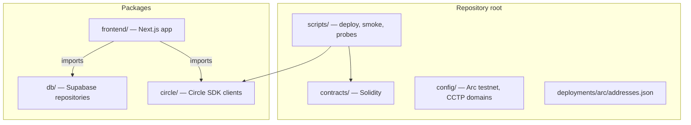

| Directory | Purpose |
|-----------|---------|
| `contracts/` | All production Solidity contracts and interfaces |
| `frontend/` | Next.js UI, API routes, hooks, components |
| `circle/src/` | Canonical Circle integration (testable in isolation) |
| `frontend/lib/circle/` | Thin re-exports into `circle/src/` for Next.js |
| `db/` | Supabase client and repository layer |
| `config/` | Arc testnet constants, CCTP destination mapping |
| `deployments/arc/` | Deployed contract address registry |
| `scripts/` | Deploy, provision, smoke tests, wire probes |

### Platform overview

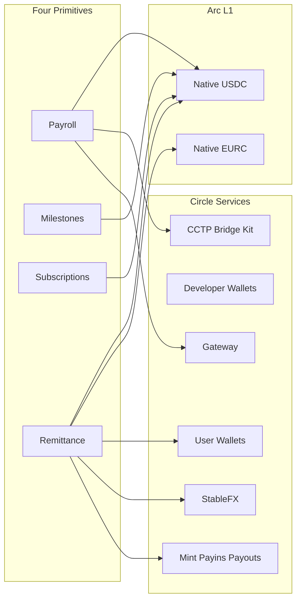

---

## The Problem

Cross-border money movement today is slow, expensive, and fragmented.

### Correspondent banking is costly and slow

Traditional SWIFT and correspondent-bank rails charge roughly **2–5%** in FX and transfer fees and take **3–5 business days** to settle. Arcittance's UI compares this directly against on-Arc settlement (~0.25% protocol fee, ~20 second settlement) via `ComparisonStrip` and [`frontend/lib/fees.ts`](frontend/lib/fees.ts):

| Metric | Traditional bank | Arcittance on Arc |
|--------|------------------|-------------------|
| Transfer fee | ~2.5% (250 bps midpoint) | ~0.25% (25 bps) |
| Settlement time | ~4 days | ~20 seconds |
| Gas currency | N/A (fiat) | USDC (native on Arc) |

### Tooling is siloed

Payroll lives in HRIS systems. Escrow lives in legal workflows. Subscriptions live in Stripe-like billing. Remittance lives in consumer apps. None of these share:

- A common settlement asset (USDC/EURC)
- Programmable on-chain rules (caps, schedules, multi-approver release)
- Cross-chain delivery (CCTP, Gateway)
- Live leg-by-leg tracking with auditable receipts

### Stablecoin infrastructure lacks programmable primitives

USDC exists on many chains, but employers, marketplaces, and remittance senders need **composable payment logic** — salary caps, recurring charge ceilings, milestone approval thresholds, dispute deadlines — enforced on-chain rather than in opaque backend databases. Arc provides the L1; Arcittance provides the application layer.

---

## The Solution (Arcittance)

Arcittance is **one payment engine, four rails**, all sharing:

1. **Native USDC/EURC on Arc** — no wrapped tokens
2. **Circle Wallets** — embedded user wallets for remittance; developer wallets for keeper/gas sponsorship
3. **Cross-chain routing** — CCTP point-to-point burn/mint or Gateway unified-balance spend
4. **StableFX** — live USDC↔EURC RFQ with Permit2 on-chain settlement
5. **Dual-rail remittance** — crypto-native (Path A), bank-intent (Path B), and mock AED corridor (Path B Mock)
6. **Off-chain orchestration** — `circle/src/*-orchestrator.ts` completes CCTP/Gateway/StableFX legs after on-chain events
7. **Persistence** — Supabase stores remittances, FX quotes, payins, payouts, mint ledger, and metadata

### End-to-end workflow (all features)

Every payment flow follows the same four-step mental model shown on the landing page:

| Step | Action | Examples |
|------|--------|----------|
| 01 Fund | Deposit USDC into vault, wallet, or bank rail | Vault deposit, Circle wallet, Mint wire, Payins |
| 02 Route | Choose Arc-local, CCTP, or Gateway | Employee destination chain, remit recipient chain |
| 03 Convert | Optional StableFX USDC↔EURC | Remit convert step |
| 04 Deliver | Payout to wallet or bank; track legs; download receipt | Payouts API, on-chain transfer, PDF receipt |

### What is demo-ready today

| Feature | Status |
|---------|--------|
| Payroll (Arc-local) | Fully working |
| Payroll (cross-chain CCTP/Gateway) | Working with orchestrator |
| Milestones | Fully working |
| Subscriptions | Fully working |
| Remit Path A (wallet + CCTP/Gateway) | Fully working |
| Remit Path B (bank wire → Mint) | **Blocked** — sandbox wire API (see Feedback) |
| Remit Path B Mock (AED corridor) | Fully working |

---

## Payroll

Payroll on Arcittance lets an employer create an on-chain organisation, deploy a dedicated vault, fund it with USDC, register employees with salary schedules and cross-chain routing preferences, and execute payroll runs — either locally on Arc or cross-chain via CCTP/Gateway.

### Architecture

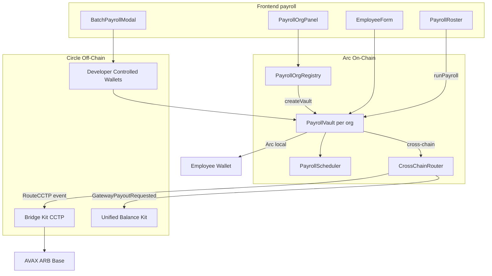

### Org and Vault Factory Pattern

`PayrollOrgRegistry` is the entry point. Each creator:

1. Calls `createOrganization(name)` — registers an org on-chain
2. Calls `createVault(orgId)` — factory-deploys a new `PayrollVault`, transfers ownership to the creator, and auto-authorizes the vault on `CrossChainRouter`

```solidity
// PayrollOrgRegistry.sol — simplified
function createVault(uint256 orgId) external returns (address vaultAddr) {
    PayrollVault vault = new PayrollVault(schedulerContract, crossChainRouter);
    vault.transferOwnership(msg.sender);
    IVaultAuthorizer(crossChainRouter).authorizeVault(vaultAddr, true);
}
```

Each organisation gets an **isolated vault** — employee rosters and balances do not mix between orgs.

> All file paths in this section link to source in this repository.

| File | Role |
|------|------|
| [PayrollOrgRegistry.sol](contracts/PayrollOrgRegistry.sol) | Org + vault factory |
| [PayrollVault.sol](contracts/PayrollVault.sol) | Per-org payroll logic |
| [PayrollOrgPanel.tsx](frontend/components/PayrollOrgPanel.tsx) | Create org + deploy vault UI |
| [usePayrollOrgRegistry.ts](frontend/hooks/usePayrollOrgRegistry.ts) | On-chain org/vault hooks |
| [PayrollOrgContext.tsx](frontend/contexts/PayrollOrgContext.tsx) | Selected org persistence |

### Employee Roster and Scheduling

After funding the vault (`deposit(token, amount)` with prior ERC-20 approve), the employer registers employees:

```solidity
function registerEmployee(
    address wallet,
    uint256 salary,
    address token,
    uint256 interval,
    uint256 cap,
    uint32 destinationChainId,  // 0 = Arc-local
    uint8 routingMethod,        // 0 = CCTP, 1 = Gateway
    uint8 transferSpeed         // 0 = standard, 1 = fast CCTP
) external onlyOwner returns (uint256 id);
```

`PayrollScheduler` is a **stateless pure contract** — it filters employees where:

- `nextPaymentDue <= block.timestamp`
- `salary <= approvedCap`

No admin key, no token access — only due-date and cap logic.

### Full payroll flow (step-by-step)

1. Connect wallet (MetaMask) to Arc testnet
2. Navigate to `/payroll`
3. **Create organisation** — `PayrollOrgRegistry.createOrganization(name)`
4. **Deploy vault** — `createVault(orgId)` → new `PayrollVault` address
5. **Fund vault** — approve USDC → `PayrollVault.deposit(USDC, amount)`
6. **Register employee** — set wallet, salary, pay interval, approved cap, destination chain, routing method
7. **Run payroll** — `PayrollVault.runPayroll()`:
   - Scheduler returns due employees
   - Arc-local employees: direct `IERC20.transfer`
   - Cross-chain employees: vault calls `CrossChainRouter.routeCCTP` or `routeGateway`
8. **Post-payroll orchestration** (CCTP path only) — frontend calls [`POST /api/cross-chain/orchestrate`](frontend/app/api/cross-chain/orchestrate/route.ts) with `{ payrollTxHash, vaultAddress }`
9. Orchestrator parses `RouteCCTP` events and runs Bridge Kit to mint USDC on destination chains
10. Employee receives USDC on destination chain wallet

### Arc-Local vs Cross-Chain Payout

| `destinationChainId` | Routing | On-chain action | Off-chain completion |
|---------------------|---------|-----------------|----------------------|
| `0` | N/A | Direct USDC transfer on Arc | None |
| `1` (Avalanche Fuji) | CCTP (`0`) | Router burns via TokenMessenger | Bridge Kit mint on Fuji |
| `1` (Avalanche Fuji) | Gateway (`1`) | Router records Gateway request | Unified Balance Kit spend |
| `3` (Arbitrum Sepolia) | CCTP / Gateway | Same pattern | Same |
| `6` (Base Sepolia) | CCTP / Gateway | Same pattern | Same |

CCTP destination mapping: [`config/cctp-domains.ts`](config/cctp-domains.ts).

### Circle Keeper and Gas Sponsorship

When `NEXT_PUBLIC_USE_CIRCLE_KEEPER=true`, a **Developer Controlled Wallet** (facilitator SCA) executes payroll on behalf of the employer with **gas sponsorship**:

| API route | Action |
|-----------|--------|
| [`POST /api/circle/keeper/run-payroll`](frontend/app/api/circle/keeper/run-payroll/route.ts) | Single payroll run |
| [`POST /api/circle/keeper/batch-payroll`](frontend/app/api/circle/keeper/batch-payroll/route.ts) | Batch employee registration + payroll |

Implementation: [`circle/src/developer-client.ts`](circle/src/developer-client.ts), [`circle/src/gas-station.ts`](circle/src/gas-station.ts).

Keeper mode is optional — normal wallet mode works without any Circle API keys for Arc-local payroll.

### Post-Payroll CCTP Orchestration

Cross-chain CCTP payroll requires a two-phase completion:

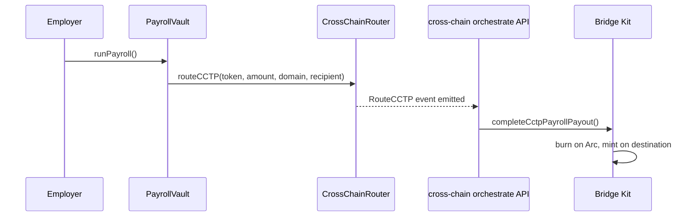

Key file: [`circle/src/cross-chain-orchestrator.ts`](circle/src/cross-chain-orchestrator.ts).

### Payroll key files

| Category | File |
|----------|------|
| Contract | [PayrollVault.sol](contracts/PayrollVault.sol) |
| Contract | [PayrollScheduler.sol](contracts/PayrollScheduler.sol) |
| Contract | [CrossChainRouter.sol](contracts/CrossChainRouter.sol) |
| Hook | [usePayrollVault.ts](frontend/hooks/usePayrollVault.ts) |
| Hook | [useCircleKeeper.ts](frontend/hooks/useCircleKeeper.ts) |
| Component | [EmployeeForm.tsx](frontend/components/EmployeeForm.tsx) |
| Component | [PayrollRoster.tsx](frontend/components/PayrollRoster.tsx) |
| Component | [BatchPayrollModal.tsx](frontend/components/BatchPayrollModal.tsx) |
| API | [payroll/route.ts](frontend/app/api/payroll/route.ts) |
| API | [organizations/route.ts](frontend/app/api/organizations/route.ts) |
| API | [orchestrate/route.ts](frontend/app/api/cross-chain/orchestrate/route.ts) |

### Supported destination chains

| Domain | Chain | Label |
|--------|-------|-------|
| `0` | Arc (`5042002`) | Arc (local) |
| `1` | Avalanche Fuji (`43113`) | Avalanche Fuji |
| `3` | Arbitrum Sepolia (`421614`) | Arbitrum Sepolia |
| `6` | Base Sepolia (`84532`) | Base Sepolia |

---

## Milestones (Conditional Escrow)

Milestone escrow is Arcittance's **conditional payment primitive** for freelance, marketplace, and project-based work. A payer locks USDC on Arc; funds release only when enough designated approvers sign off. If work is never accepted, the payer reclaims after a dispute deadline. Financial rules live entirely on-chain — title and description are stored off-chain for UX.

### Design intent

Traditional escrow relies on legal contracts and manual dispute resolution. Arcittance encodes the rules in [`ConditionalEscrow.sol`](contracts/ConditionalEscrow.sol):

- **N-of-M approver governance** — e.g. 2-of-3 stakeholders must approve before release
- **Immutable approver list** — set at creation; cannot be changed mid-flight
- **Dispute deadline** — payer can reclaim if approvers never release
- **Native USDC on Arc** — no wrapped tokens; gas paid in USDC

This maps directly to milestone-based freelance payments, DAO deliverable funding, and marketplace escrow where a platform or client must sign off before a contractor is paid.

### System architecture

The milestone stack spans UI, API, Supabase metadata, and on-chain escrow:

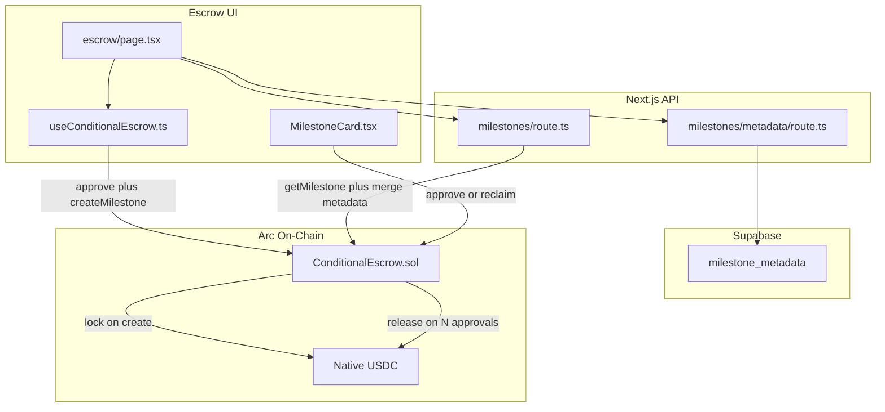

### Create → approve → release sequence

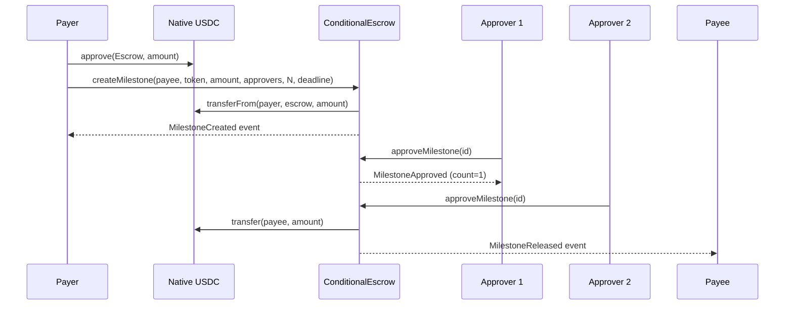

### On-chain state machine (financial lifecycle)

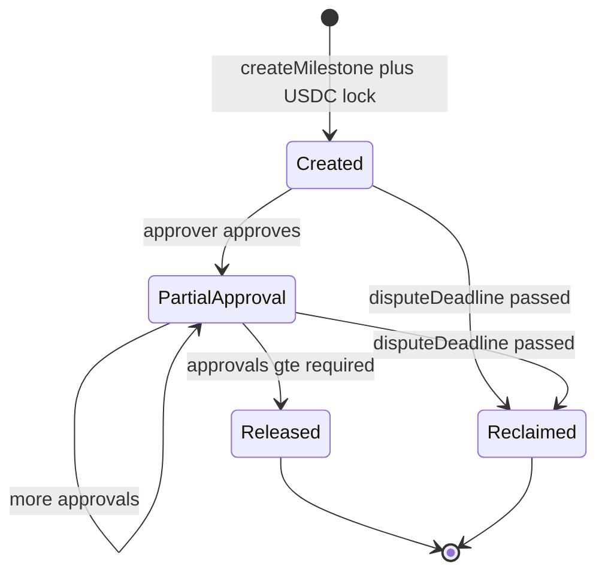

Once `released` or `reclaimed` is true, the milestone is terminal — no further transitions.

### On-chain data model

Each milestone is stored in the `Milestone` struct in [ConditionalEscrow.sol](contracts/ConditionalEscrow.sol):

| Field | Type | Purpose |
|-------|------|---------|
| `payer` | address | Who locked the funds |
| `payee` | address | Who receives on release |
| `token` | address | USDC (or EURC) contract address |
| `amount` | uint256 | Locked amount in token base units (6 decimals) |
| `approvers` | address[] | Immutable list of addresses that can approve |
| `approvalsRequired` | uint256 | Minimum approvals needed (N in N-of-M) |
| `approvalCount` | uint256 | Running count of approvals received |
| `hasApproved` | mapping | Prevents double-approval by same address |
| `disputeDeadline` | uint256 | Unix timestamp — payer can reclaim after this |
| `released` | bool | True after funds sent to payee |
| `reclaimed` | bool | True after funds returned to payer |

### On-chain lifecycle

| Function | Actor | Effect |
|----------|-------|--------|
| `createMilestone(...)` | Payer | Locks USDC in escrow (requires prior ERC-20 approve) |
| `approveMilestone(id)` | Listed approver | Increments approval count; auto-releases when threshold met |
| Auto-release | Contract | When `approvalCount >= approvalsRequired`, transfers to payee |
| `reclaimExpired(id)` | Payer | After `disputeDeadline`, if not released, returns funds to payer |

### Security properties

- **ReentrancyGuard** — all state-changing functions are non-reentrant
- **Immutable approvers** — approver list cannot be modified after creation
- **Connected-wallet create** — `createMilestone` always runs from the user's MetaMask/wagmi wallet so on-chain `payer` is the wallet that locked funds (required for `reclaimExpired`)
- **No keeper on create/approve/reclaim** — Circle keeper mode does not create milestones; approvers and payers must sign with their own wallets
- **Double-approval prevention** — `hasApproved` mapping reverts if the same approver tries twice
- **Deadline enforcement** — reclaim only succeeds after `block.timestamp > disputeDeadline` and milestone is not already released; the UI hides **Approve & Release** after the deadline so only the payer can **Reclaim**

### Split storage model

Arcittance deliberately splits on-chain financial data from off-chain descriptive metadata:

| Layer | Stores | Why |
|-------|--------|-----|
| **On-chain** ([ConditionalEscrow.sol](contracts/ConditionalEscrow.sol)) | payer, payee, amount, approvers, deadlines, release state | Immutable financial truth; auditable on Arcscan |
| **Supabase** (via [milestones/metadata/route.ts](frontend/app/api/milestones/metadata/route.ts)) | title, description | Human-readable labels; cheap to update; not needed for settlement |

The list API ([milestones/route.ts](frontend/app/api/milestones/route.ts)) reads on-chain `getMilestone(id)` and merges Supabase metadata for display in [MilestoneCard.tsx](frontend/components/MilestoneCard.tsx).

### Full milestone flow (step-by-step)

1. Navigate to [`/escrow`](frontend/app/escrow/page.tsx)
2. Fill form: title, description, payee address, amount, approvers, approvals required, dispute deadline
3. **Approve USDC** — payer sends `approve(ConditionalEscrow, amount)` tx on Arc
4. **Create milestone** — payer calls `createMilestone(...)` via [useConditionalEscrow.ts](frontend/hooks/useConditionalEscrow.ts); USDC locked in escrow
5. **Save metadata** — [`POST /api/milestones/metadata`](frontend/app/api/milestones/metadata/route.ts) stores title/description in Supabase
6. Approvers see milestone in list via [`GET /api/milestones`](frontend/app/api/milestones/route.ts)
7. Each approver connects wallet and calls `approveMilestone(id)` — must be their own signature
8. When `approvalCount >= approvalsRequired` → contract auto-transfers USDC to payee; `MilestoneReleased` event emitted
9. If deadline passes without release → payer calls `reclaimExpired(id)`; USDC returned; `MilestoneReclaimed` event emitted

### Payer identity and reclaim

Milestone create always uses the **connected wallet**, even when `NEXT_PUBLIC_USE_CIRCLE_KEEPER=true` (keeper remains available for payroll and subscription charges only).

Why: `reclaimExpired(id)` requires `msg.sender == milestone.payer`. If a Circle facilitator wallet created the milestone, the on-chain payer would be the facilitator — the user's MetaMask would only appear as an approver, so after the deadline the UI would show **Approve & Release** (send to payee) instead of **Reclaim** (return to payer).

| Action | Who signs | Notes |
|--------|-----------|-------|
| Create + lock | Connected wallet | Becomes on-chain `payer` |
| Approve & release | Listed approver wallet | Hidden in UI after `disputeDeadline` |
| Reclaim | On-chain payer wallet | Shown only when connected address matches `payer` and deadline has passed |

The API route [`POST /api/circle/keeper/create-milestone`](frontend/app/api/circle/keeper/create-milestone/route.ts) still exists for scripts/tests, but the escrow UI and [`useConditionalEscrow.ts`](frontend/hooks/useConditionalEscrow.ts) do not call it.

### Indexer events

| Event | When emitted | Key indexed fields |
|-------|--------------|-------------------|
| `MilestoneCreated` | After create + lock | `id`, `payer`, `payee`, `amount` |
| `MilestoneApproved` | Each approver signs | `id`, `approver`, `approvalCount` |
| `MilestoneReleased` | Threshold met | `id`, `payee`, `amount` |
| `MilestoneReclaimed` | Payer reclaims after deadline | `id`, `payer`, `amount` |

### Key files

| Role | File |
|------|------|
| Contract | [ConditionalEscrow.sol](contracts/ConditionalEscrow.sol) |
| UI page | [escrow/page.tsx](frontend/app/escrow/page.tsx) |
| Milestone card | [MilestoneCard.tsx](frontend/components/MilestoneCard.tsx) |
| Contract hooks | [useConditionalEscrow.ts](frontend/hooks/useConditionalEscrow.ts) |
| List API | [milestones/route.ts](frontend/app/api/milestones/route.ts) |
| Metadata API | [milestones/metadata/route.ts](frontend/app/api/milestones/metadata/route.ts) |

---

## Subscriptions

Subscriptions are Arcittance's **recurring billing primitive** — providers publish plans; subscribers opt in with a hard spending cap; anyone can trigger a charge when due. Unlike Stripe-style off-chain billing, caps and charge history are enforced on-chain in [`SubscriptionManager.sol`](contracts/SubscriptionManager.sol).

### Design intent

Traditional subscription billing (Stripe, PayPal) pulls from a card with opaque backend logic. Arcittance inverts the trust model:

- **Subscriber sets `approvedCap`** — a hard on-chain ceiling on total lifetime spend
- **Public `charge()` function** — any address can call when due (cron-friendly, keeper-friendly)
- **ERC-20 allowance model** — subscriber approves USDC once; contract pulls per charge
- **Revocable at any time** — subscriber calls `revoke()` to stop future charges

This suits SaaS on Arc, marketplace platform fees, and any recurring USDC/EURC billing where the subscriber must retain control over maximum exposure.

### System architecture

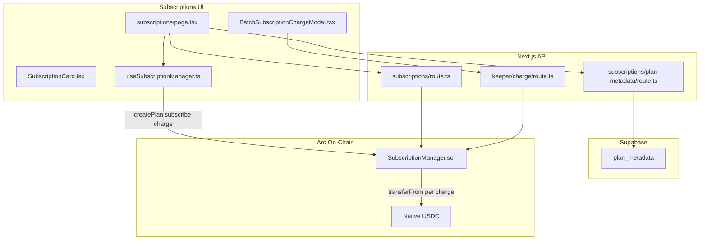

### Plan and subscription lifecycles

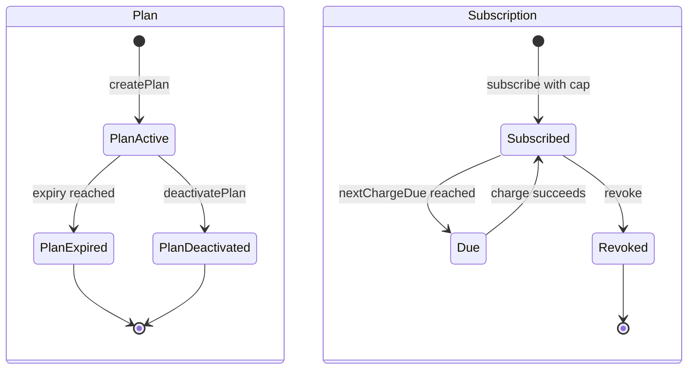

### Charge sequence

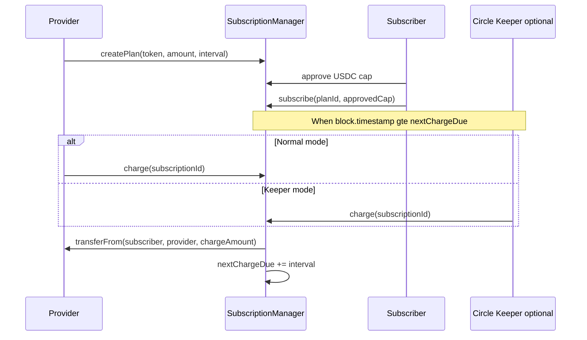

### On-chain data model

Contract: [SubscriptionManager.sol](contracts/SubscriptionManager.sol)

**Plan struct:**

| Field | Purpose |
|-------|---------|
| `provider` | Address that receives charges |
| `token` | USDC or EURC address |
| `chargeAmount` | Amount per billing interval (6 decimals) |
| `interval` | Seconds between eligible charges |
| `maxCharges` | Maximum charge count (0 = unlimited) |
| `chargeCount` | Internal counter of charges executed |
| `expiry` | Unix timestamp when plan expires (0 = never) |
| `active` | Whether plan accepts new subscriptions |

**Subscription struct:**

| Field | Purpose |
|-------|---------|
| `subscriber` | Address being billed |
| `planId` | Reference to parent plan |
| `approvedCap` | Hard ceiling on total spend (set by subscriber) |
| `totalCharged` | Running total charged so far |
| `nextChargeDue` | Timestamp when next charge becomes eligible |
| `active` | Whether subscription can be charged |

**Cap enforcement:** each `charge()` requires `totalCharged + chargeAmount <= approvedCap`. If the cap would be exceeded, the transaction reverts.

### Charge preconditions

A charge succeeds only when **all** of the following hold:

1. Subscription `active == true`
2. Plan `active == true` and not past `expiry`
3. `block.timestamp >= nextChargeDue`
4. Plan `chargeCount < maxCharges` (if maxCharges > 0)
5. `totalCharged + chargeAmount <= approvedCap`
6. Subscriber has ERC-20 `allowance >= chargeAmount` to the contract
7. Subscriber wallet balance >= chargeAmount

If any condition fails, the contract reverts — there is no partial charge or off-chain override.

### Comparison to traditional billing

| Aspect | Stripe / card billing | Arcittance subscriptions |
|--------|----------------------|--------------------------|
| Spend cap | Soft limit (disputes) | Hard on-chain `approvedCap` |
| Who can charge | Merchant backend only | Anyone when due (public `charge()`) |
| Settlement | Fiat, T+2 | USDC/EURC on Arc, immediate |
| Revocation | Cancel via API | On-chain `revoke()` in one tx |
| Audit trail | Merchant database | Arcscan events + on-chain state |

### Full subscription flow (step-by-step)

1. Navigate to [`/subscriptions`](frontend/app/subscriptions/page.tsx)
2. **Provider:** call `createPlan(token, chargeAmount, interval, maxCharges, expiry)` on-chain
3. **Provider:** save title/description via [`POST /api/subscriptions/plan-metadata`](frontend/app/api/subscriptions/plan-metadata/route.ts)
4. **Subscriber:** select plan, set spend cap, approve USDC to contract, call `subscribe(planId, approvedCap)`
5. When `block.timestamp >= nextChargeDue`, provider (or anyone) clicks **Charge**
6. `charge(subscriptionId)` executes `transferFrom(subscriber, provider, chargeAmount)`
7. `totalCharged` increments; `nextChargeDue` advances by plan `interval`
8. Subscriber can call `revoke(subscriptionId)` at any time to stop future charges
9. Provider can call `deactivatePlan(planId)` to stop new subscriptions

### Batch billing (marketplace)

[BatchSubscriptionChargeModal.tsx](frontend/components/BatchSubscriptionChargeModal.tsx) loops keeper charges across many due subscriptions in one session — useful for platform operators billing a marketplace roster.

- Route: [`POST /api/circle/keeper/charge`](frontend/app/api/circle/keeper/charge/route.ts)
- Requires `NEXT_PUBLIC_USE_CIRCLE_KEEPER=true` and funded facilitator wallet
- Each charge is still an individual on-chain `charge()` call with gas sponsorship

### Metadata

Plan title and description live in Supabase (not on-chain) via [plan-metadata/route.ts](frontend/app/api/subscriptions/plan-metadata/route.ts). The list API [subscriptions/route.ts](frontend/app/api/subscriptions/route.ts) merges on-chain plan/subscription state with metadata for [SubscriptionCard.tsx](frontend/components/SubscriptionCard.tsx).

### Key files

| Role | File |
|------|------|
| Contract | [SubscriptionManager.sol](contracts/SubscriptionManager.sol) |
| UI page | [subscriptions/page.tsx](frontend/app/subscriptions/page.tsx) |
| Plan/subscription card | [SubscriptionCard.tsx](frontend/components/SubscriptionCard.tsx) |
| Batch keeper charges | [BatchSubscriptionChargeModal.tsx](frontend/components/BatchSubscriptionChargeModal.tsx) |
| Contract hooks | [useSubscriptionManager.ts](frontend/hooks/useSubscriptionManager.ts) |
| List API | [subscriptions/route.ts](frontend/app/api/subscriptions/route.ts) |
| Plan metadata API | [subscriptions/plan-metadata/route.ts](frontend/app/api/subscriptions/plan-metadata/route.ts) |
| Keeper charge | [keeper/charge/route.ts](frontend/app/api/circle/keeper/charge/route.ts) |

---

## Remittance

Consumer remittance supports **three funding paths** sharing optional StableFX conversion, compliance screening, leg tracking, and PDF receipts.

| Path | Label | Funding | Delivery |
|------|-------|---------|----------|
| **A** | Path A · Wallet | Circle embedded user wallet | Crypto on-chain (Arc, CCTP, Gateway) |
| **B** | Path B · Bank | Sandbox wire → Mint fiat → mint USDC | Payouts (crypto) or Mint fiat wire |
| **B_MOCK** | Path B · Bank-mock | Simulated AED bank → Payins top-up | Payouts (crypto) + AED bank UX |

UI: [`frontend/app/remit/page.tsx`](frontend/app/remit/page.tsx) — step machine with path toggle and leg tracker.

---

### Crypto-Native Remittance (Path A)

Path A is Arcittance's **fully crypto-native remittance rail**. The sender signs in with Circle User Wallets (W3S), holds USDC/EURC in an embedded wallet on Arc, optionally converts via StableFX, then delivers to a recipient locally on Arc or cross-chain via CCTP or Gateway. Every leg is tracked in [SettlementTracker.tsx](frontend/components/SettlementTracker.tsx) with a downloadable PDF receipt.

Path A is the most Circle-integrated consumer flow — it exercises User Wallets, StableFX, Bridge Kit, Unified Balance Kit, and compliance screening in a single stepper UI at [`/remit`](frontend/app/remit/page.tsx).

#### End-to-end layer architecture

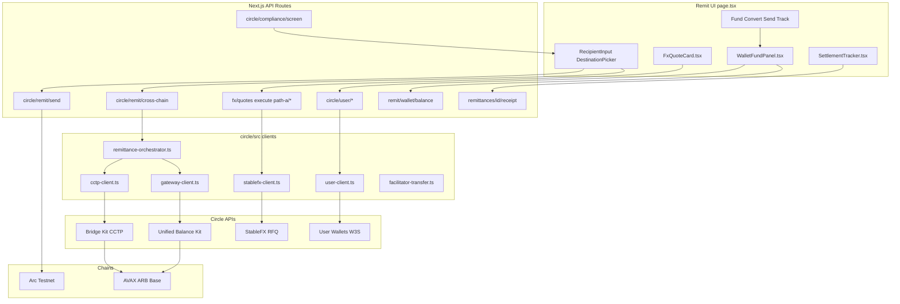

#### UI stepper

| Step | Component | Action |
|------|-----------|--------|
| Fund | [WalletFundPanel.tsx](frontend/components/WalletFundPanel.tsx) | Circle sign-in; balance from [wallet/balance/route.ts](frontend/app/api/remit/wallet/balance/route.ts) |
| Convert | [FxQuoteCard.tsx](frontend/components/FxQuoteCard.tsx) | Optional USDC↔EURC via StableFX |
| Send | [RecipientInput.tsx](frontend/components/RecipientInput.tsx), [DestinationPicker.tsx](frontend/components/DestinationPicker.tsx), [FeePanel.tsx](frontend/components/FeePanel.tsx) | Local, CCTP, or Gateway send |
| Track | [SettlementTracker.tsx](frontend/components/SettlementTracker.tsx), [ReceiptDownload.tsx](frontend/components/ReceiptDownload.tsx) | Leg status + PDF receipt |

#### Sign-in and wallet provisioning

Path A requires Circle User Wallets sign-in via [RemittanceWalletConnector.tsx](frontend/components/RemittanceWalletConnector.tsx):

1. [`POST /api/circle/user/initialize`](frontend/app/api/circle/user/initialize/route.ts) — create or resume user
2. [`POST /api/circle/user/request-otp`](frontend/app/api/circle/user/request-otp/route.ts) — email OTP
3. [`POST /api/circle/user/session`](frontend/app/api/circle/user/session/route.ts) — acquire session token
4. [`GET /api/circle/user/wallet`](frontend/app/api/circle/user/wallet/route.ts) — embedded wallet on Arc

Implementation: [user-client.ts](circle/src/user-client.ts), [RemittanceWalletContext.tsx](frontend/components/RemittanceWalletContext.tsx), Web SDK via [execute-challenge.ts](frontend/lib/circle/execute-challenge.ts).

#### StableFX convert leg (optional)

When the sender wants USDC↔EURC before sending:

| Step | API route | What happens |
|------|-----------|--------------|
| 1 | [fx/quotes/route.ts](frontend/app/api/fx/quotes/route.ts) | Live StableFX RFQ; balance check against wallet |
| 2 | [fx/path-a/prepare-debit/route.ts](frontend/app/api/fx/path-a/prepare-debit/route.ts) | Challenge: user wallet → facilitator EOA |
| 3 | Browser Web SDK | User executes Circle transfer challenge |
| 4 | [fx/path-a/wait-debit/route.ts](frontend/app/api/fx/path-a/wait-debit/route.ts) | Confirm debit landed on facilitator |
| 5 | [fx/execute/route.ts](frontend/app/api/fx/execute/route.ts) | NDJSON stream: RFQ → EIP-712 sign → Permit2 fund → on-chain settle |
| 6 | [facilitator-transfer.ts](circle/src/facilitator-transfer.ts) | Facilitator sends output token back to user wallet |

#### Arc-local send

For recipients on Arc (`destinationChainId = 0`):

1. [`POST /api/circle/compliance/screen`](frontend/app/api/circle/compliance/screen/route.ts) — blocklist check
2. [`POST /api/circle/remit/send`](frontend/app/api/circle/remit/send/route.ts) — prepare transfer challenge
3. Web SDK executes challenge — user wallet sends USDC/EURC directly to recipient on Arc
4. Remittance row persisted via [remittances/route.ts](frontend/app/api/remittances/route.ts)

#### Cross-chain send (CCTP vs Gateway)

For recipients on Avalanche Fuji, Arbitrum Sepolia, or Base Sepolia, orchestration runs through [remittance-orchestrator.ts](circle/src/remittance-orchestrator.ts):

**Step 1 — Prepare debit:** `prepareCrossChainRemittance()` creates a Circle transfer challenge. User wallet debits USDC to the facilitator address on Arc.

**Step 2 — Complete:** after Web SDK challenge, `completeCrossChainRemittance()` branches on `routingMethod`:

| routingMethod | Facilitator wallet | Off-chain action |
|---------------|-------------------|------------------|
| `0` (CCTP) | **EOA** (`FACILITATOR_PRIVATE_KEY`) | [cctp-client.ts](circle/src/cctp-client.ts) Bridge Kit burn on Arc → mint on destination |
| `1` (Gateway) | **SCA** (`CIRCLE_FACILITATOR_WALLET_ID`) | [gateway-client.ts](circle/src/gateway-client.ts) deposit unified balance → spend on destination |

Why two wallets? From [remittance-orchestrator.ts](circle/src/remittance-orchestrator.ts):

> CCTP burns from the facilitator EOA (private-key Bridge Kit adapter). Gateway deposit/spend uses the Circle SCA wallet — remit debit must land there.

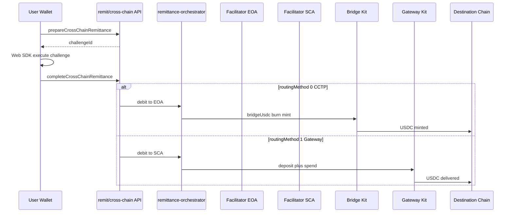

API route: [remit/cross-chain/route.ts](frontend/app/api/circle/remit/cross-chain/route.ts).

#### Facilitator dual-wallet model

| Wallet | Env key | Used for |
|--------|---------|----------|
| Facilitator EOA | `FACILITATOR_PRIVATE_KEY` | CCTP burns via Bridge Kit; StableFX EIP-712 signing; Path A FX debit target |
| Facilitator SCA | `CIRCLE_FACILITATOR_WALLET_ID` | Gateway unified-balance deposit + spend; cross-chain Gateway routing debits |

Both must be funded with Arc USDC for their respective paths to succeed.

#### Compliance, tracking, and receipts

- **Compliance gate** — [compliance.ts](circle/src/compliance.ts) blocklist via `CIRCLE_COMPLIANCE_BLOCKLIST` runs before every send
- **Leg tracking** — [SettlementTracker.tsx](frontend/components/SettlementTracker.tsx) shows fund, FX, bridge, and delivery legs with tx hashes and explorer links
- **Persistence** — remittance rows in Supabase via [remittances/route.ts](frontend/app/api/remittances/route.ts)
- **PDF receipt** — [remittances/[id]/receipt/route.ts](frontend/app/api/remittances/[id]/receipt/route.ts) generates downloadable receipt via [generateReceipt.ts](frontend/lib/receipts/generateReceipt.ts)

#### EURC constraint

EURC is supported for **Arc same-chain sends only**. CCTP and Gateway routing are USDC-only — the UI enforces this in [DestinationPicker.tsx](frontend/components/DestinationPicker.tsx).

#### Path A full flow (step-by-step)

1. **Sign in** — [RemittanceWalletConnector.tsx](frontend/components/RemittanceWalletConnector.tsx) → Circle W3S OTP/PIN
2. **Fund** — embedded wallet holds USDC/EURC; balance from [wallet/balance/route.ts](frontend/app/api/remit/wallet/balance/route.ts)
3. **Convert (optional)** — 5-step StableFX chain above
4. **Send** — compliance screen → local or cross-chain send
5. **Track** — [SettlementTracker.tsx](frontend/components/SettlementTracker.tsx) polls leg status
6. **Receipt** — PDF download from receipt API

#### Path A key files

| Role | File |
|------|------|
| UI orchestrator | [remit/page.tsx](frontend/app/remit/page.tsx) |
| Cross-chain orchestrator | [remittance-orchestrator.ts](circle/src/remittance-orchestrator.ts) |
| User Wallets client | [user-client.ts](circle/src/user-client.ts) |
| StableFX client | [stablefx-client.ts](circle/src/stablefx-client.ts) |
| CCTP client | [cctp-client.ts](circle/src/cctp-client.ts) |
| Gateway client | [gateway-client.ts](circle/src/gateway-client.ts) |
| Arc-local send API | [remit/send/route.ts](frontend/app/api/circle/remit/send/route.ts) |
| Cross-chain send API | [remit/cross-chain/route.ts](frontend/app/api/circle/remit/cross-chain/route.ts) |

---

### Bank-Based Remittance (Path B)

Path B is Arcittance's **fiat-on-ramp remittance rail** — designed for senders who fund from a bank wire rather than a crypto wallet. The intended corridor is:

```
sender bank wire → Circle Mint credits fiat → mint USDC on Arc → app ledger attributes balance → deliver via Payouts (crypto) or Mint fiat wire (bank)
```

Path B exercises Circle Mint (wire ramp + on-chain mint), Custody, Payouts, Address Book, and optionally StableFX. The UI follows Fund → Convert → Send → Track in [BankFundPanel.tsx](frontend/components/BankFundPanel.tsx).

> **Sandbox status:** Phase 1 (wire-bank create) is blocked in Circle sandbox. See [Path B Sandbox Blocker](#path-b-sandbox-blocker-circle-wire-api). Phases 2–5 were verified independently via Payins top-up.

#### Multi-phase architecture

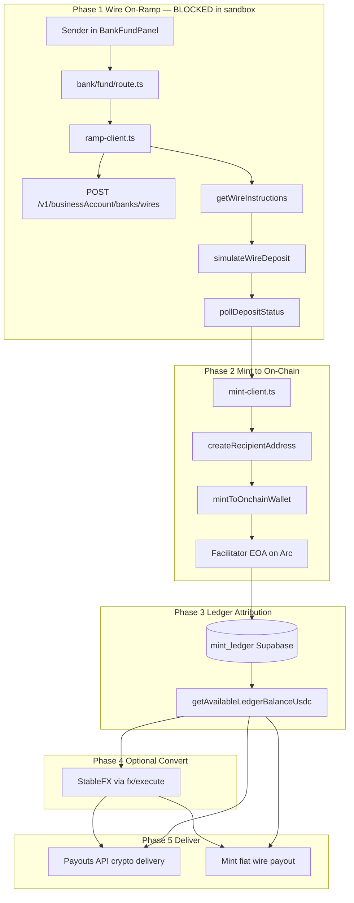

#### Phase 1 — Wire on-ramp (fund)

Mapped to [bank/fund/route.ts](frontend/app/api/remit/bank/fund/route.ts) and [ramp-client.ts](circle/src/ramp-client.ts):

| Step | Function / API | What happens |
|------|----------------|--------------|
| 1 | `createMintLedgerEntry()` | Supabase row created with status `pending` |
| 2 | `createSandboxBankAccount()` | `POST /v1/businessAccount/banks/wires` — **fails with HTTP 500 in sandbox** |
| 3 | `getWireInstructions(bankId)` | Returns tracking ref + virtual account number for wire |
| 4 | `simulateWireDeposit()` | Sandbox mock of incoming wire to Mint |
| 5 | `pollDepositStatus()` | Poll until deposit status is complete (45s timeout) |
| 6 | Ledger updated | Status → `deposited`; deposit ID stored in metadata |

If step 2 fails (current sandbox behavior), the entire Path B fund flow cannot proceed. The codebase detects this via `isCircleEftSandboxOutage()` in [ramp-client.ts](circle/src/ramp-client.ts).

#### Phase 2 — Mint to on-chain USDC

After fiat credit lands in Circle Mint, USDC must be minted to an on-chain address:

| Step | Function | What happens |
|------|----------|--------------|
| 1 | `createRecipientAddress()` | Allowlist facilitator EOA in Mint Console |
| 2 | `mintToOnchainWallet()` | Convert Mint USD balance → USDC on Arc at facilitator EOA |
| 3 | Poll business transfer | Wait for mint transfer to complete |
| 4 | Ledger updated | Status → `minted`; on-chain tx hash stored |

Implementation: [mint-client.ts](circle/src/mint-client.ts). Facilitator EOA from `FACILITATOR_PRIVATE_KEY` via [wallet-adapters.ts](circle/src/wallet-adapters.ts).

#### Phase 3 — Ledger attribution

Path B uses a **shared facilitator USDC pool** on-chain. Multiple senders can fund through the same facilitator address without balance confusion:

- Each fund creates a row in `mint_ledger` (Supabase) keyed by `sender_user_id`
- `getAvailableLedgerBalanceUsdc(userId)` in [mint_ledger.ts](db/src/repositories/mint_ledger.ts) computes how much of the shared pool belongs to this sender
- StableFX convert and send steps check against ledger-attributed balance, not raw on-chain facilitator balance

This mirrors how a real Mint business account would work — one custody pool, per-customer attribution in the app layer.

#### Phase 4 — Optional StableFX convert

Same StableFX flow as Path A, but funding source is **ledger balance** (facilitator EOA attributed to user) rather than user wallet:

- [`POST /api/fx/quotes`](frontend/app/api/fx/quotes/route.ts) — quote with ledger balance check
- [`POST /api/fx/execute`](frontend/app/api/fx/execute/route.ts) — facilitator EOA signs and settles trade
- Converted USDC/EURC remains attributed to sender in ledger

#### Phase 5a — Crypto delivery (Payouts)

The primary delivery path — USDC to recipient wallet on any supported chain:

| Step | Route / client | What happens |
|------|----------------|--------------|
| 1 | [recipients/route.ts](frontend/app/api/remit/recipients/route.ts) | Register recipient in Circle Address Book |
| 2 | [remittances/route.ts](frontend/app/api/remittances/route.ts) | Create remittance record in Supabase |
| 3 | [payouts/route.ts](frontend/app/api/remit/payouts/route.ts) | Create Circle Stablecoin Payout from custody wallet |
| 4 | [payouts-client.ts](circle/src/payouts-client.ts) | Specify chain, amount, currency; poll terminal status |
| 5 | [payouts/[id]/route.ts](frontend/app/api/remit/payouts/[id]/route.ts) | Poll until complete/failed |
| 6 | Receipt | PDF via [receipt/route.ts](frontend/app/api/remittances/[id]/receipt/route.ts) |

Payouts source wallet: primary custody wallet from [custody-client.ts](circle/src/custody-client.ts).

Supported delivery chains: Arc, Avalanche Fuji, Arbitrum Sepolia, Base Sepolia ([supported-chains.ts](circle/src/supported-chains.ts)).

#### Phase 5b — Fiat delivery (Mint wire payout)

Alternative delivery — wire USDC value back out as fiat to a destination bank:

| Step | Route / client | What happens |
|------|----------------|--------------|
| 1 | [fiat/payout/route.ts](frontend/app/api/remit/fiat/payout/route.ts) | Initiate Mint business bank payout |
| 2 | `createBusinessBankPayout()` in [mint-client.ts](circle/src/mint-client.ts) | Wire from Mint business account to destination bank ID |

Requires a registered destination bank ID in Mint Console.

#### UI flow

[BankFundPanel.tsx](frontend/components/BankFundPanel.tsx) drives the Fund step. After funding, the remit stepper continues:

| Step | Action |
|------|--------|
| Fund | Wire amount → Mint credit → mint to chain → ledger credit |
| Convert | Optional StableFX against ledger balance |
| Send | Choose crypto (Payouts) or fiat (Mint wire) delivery |
| Track | Poll payout status; show legs in [SettlementTracker.tsx](frontend/components/SettlementTracker.tsx) |

#### Circle products touched

| Product | Phase | Client |
|---------|-------|--------|
| Mint Wire Ramp | 1 | [ramp-client.ts](circle/src/ramp-client.ts) |
| Mint On-chain Mint | 2 | [mint-client.ts](circle/src/mint-client.ts) |
| Custody | 5a | [custody-client.ts](circle/src/custody-client.ts) |
| Payouts + Address Book | 5a | [payouts-client.ts](circle/src/payouts-client.ts) |
| Mint Fiat Payout | 5b | [mint-client.ts](circle/src/mint-client.ts) |
| StableFX | 4 | [stablefx-client.ts](circle/src/stablefx-client.ts) |

#### Path B key files

| Role | File |
|------|------|
| Fund API | [bank/fund/route.ts](frontend/app/api/remit/bank/fund/route.ts) |
| Wire ramp client | [ramp-client.ts](circle/src/ramp-client.ts) |
| Mint client | [mint-client.ts](circle/src/mint-client.ts) |
| Payouts client | [payouts-client.ts](circle/src/payouts-client.ts) |
| Custody client | [custody-client.ts](circle/src/custody-client.ts) |
| Ledger repository | [mint_ledger.ts](db/src/repositories/mint_ledger.ts) |
| Fund UI | [BankFundPanel.tsx](frontend/components/BankFundPanel.tsx) |
| Payouts API | [payouts/route.ts](frontend/app/api/remit/payouts/route.ts) |
| Fiat payout API | [fiat/payout/route.ts](frontend/app/api/remit/fiat/payout/route.ts) |

---

### Path B Sandbox Blocker (Circle Wire API)

Path B is **blocked at step one** in Circle's sandbox: linking/creating a wire bank account.

#### Intended first step

Path B requires a linked wire bank via:

```
POST https://api-sandbox.circle.com/v1/businessAccount/banks/wires
```

This is Circle's sandbox step to register a bank so you can receive wire instructions and mock a fiat wire deposit to credit the Mint ledger.

#### What Circle returned

The API answered with **HTTP 500**, not a validation 4xx. The error body pointed at an internal service named **`eft-sandbox-eft`**: Circle's sandbox EFT / wire-bank backend tried to handle the create, retried, then gave up. The failure is inside Circle's fiat-account stack in sandbox — not "your JSON is wrong."

#### What we tried

| Hypothesis | Test | Result |
|------------|------|--------|
| Bad idempotency key | Fresh UUID every call | Same 500 |
| Wrong account/routing | Circle's documented sandbox ABA + account (`12340010` / `121000248`) | Same 500 |
| Wrong API path | `/v1/businessAccount/banks/wires` vs legacy `/v1/banks/wires` | Same 500 + eft-sandbox-eft pattern |
| Auth broken? | Balances, Payins, Payouts with same key | All worked |

Probe scripts in this repo:

```bash
npm run test:mint-wire-variants   # Matrix of wire-bank create payloads
npm run test:mint-bank-rail         # Full Path B smoke (fails at bank create)
```

The codebase detects this outage explicitly:

```typescript
// circle/src/ramp-client.ts
export function isCircleEftSandboxOutage(err: unknown): boolean {
  const msg = err instanceof Error ? err.message : String(err);
  return (
    msg.includes("eft-sandbox-eft") ||
    msg.includes("fiatAccounts/wires") ||
    (msg.includes("banks/wires") && msg.includes("500"))
  );
}
```

#### What still worked

| Circle product | Status in sandbox |
|----------------|-------------------|
| Payins (crypto deposit into Mint) | Working — Mint balance (~$19.82) came from Payins, not wire |
| Payouts (USDC to on-chain address) | Working — verified Base, etc. |
| StableFX | Working |
| User Wallets | Working |
| Auth + balances | Working |

#### Impact

Without a successful bank link you cannot:
- Get wire instructions
- Run mock wire deposit
- Complete the real Path B "fiat wire → Mint credit" onramp

Downstream pieces (Payins top-up, Stablecoin Payouts) were fine; only the sandbox EFT wire-bank create path was dead.

---

### Bank Remittance Mock (Path B Mock)

Because Path B's wire rail was broken, we built **Path B · Bank-mock** — a conceptual AED corridor UX that reuses Path B's delivery stack without depending on the broken wire API.

#### Architecture

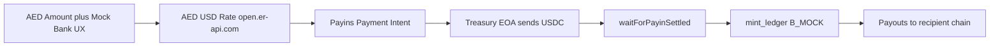

#### What B_MOCK reuses from Path B

| Component | Reused? |
|-----------|---------|
| `mint_ledger` table | Yes — same attribution model |
| Payouts API + Address Book | Yes — same delivery |
| Remittance tracking + receipts | Yes |
| StableFX convert step | Skipped — one-shot fund → payout |
| Circle wire APIs | **No** — replaced by Payins + treasury |

#### What B_MOCK replaces

Instead of wire → Mint fiat credit:

1. User enters **AED amount** + mock sender/recipient bank details (e.g. FAB Demo → ENBD Demo)
2. `GET /api/remit/bank-mock/quote` — live AED/USD rate from open.er-api.com (`circle/src/aed-fx.ts`)
3. `POST /api/remit/bank-mock/fund`:
   - Convert AED → USDC (1 USD = 1 USDC peg)
   - Create Payins payment intent
   - Treasury EOA (`TREASURY_PRIVATE_KEY`) sends USDC to Payins deposit address
   - Wait for Payins settlement (`waitForPayinSettled`)
   - Credit `mint_ledger` with `path: B_MOCK` metadata
4. UI **auto-chains** fund → compliance → recipient register → remittance → payout in `page.tsx` `onFunded` callback
5. Track step shows AED "settled" to recipient mock bank name

#### B_MOCK vs Path B comparison

| Aspect | Path B (real) | Path B Mock |
|--------|---------------|-------------|
| Circle wire APIs | Yes | No |
| Input currency | USD wire amount | AED + mock bank fields |
| FX at fund time | None | open.er-api.com AED→USD |
| Onchain Mint funding | Wire deposit → mint | Treasury USDC → Payins |
| UI steps | Fund → Convert → Send → Track | Fund (auto-payout) → Track |
| Env required | `CIRCLE_MINT_API_KEY` + allowlisted facilitator | `TREASURY_PRIVATE_KEY` funded on Arc |
| Component | `BankFundPanel.tsx` | `BankMockFundPanel.tsx` |

#### B_MOCK flow (step-by-step)

1. Select **Path B · Bank-mock** in remit UI
2. Enter AED amount, sender bank (e.g. "FAB Demo"), recipient bank (e.g. "ENBD Demo")
3. Click Fund — auto-runs entire corridor through payout
4. Track shows legs: AED quote → Payins → treasury send → ledger credit → Payouts → destination chain
5. Download receipt showing full corridor

Required env: `TREASURY_PRIVATE_KEY` with Arc USDC balance; `CIRCLE_MINT_API_KEY` for Payins/Payouts.

---

## Circle Integrations

Arcittance integrates **every major Circle product** relevant to programmable stablecoin payments. The canonical SDK layer lives in [`circle/src/`](circle/src/); the frontend re-exports via [`frontend/lib/circle/`](frontend/lib/circle/).

### Master integration table

| Circle Product | SDK / Package | Client file | Used in | Purpose |
|----------------|---------------|-------------|---------|---------|
| User Wallets (W3S) | `@circle-fin/w3s-pw-web-sdk` | `user-client.ts` | Remit Path A | Sign-in, OTP, embedded wallet, transfers, balance |
| Developer Controlled Wallets | `@circle-fin/developer-controlled-wallets` | `developer-client.ts` | Payroll keeper, subscription charge, Gateway SCA | Gasless contract calls, facilitator smart contract account |
| Gas Station | Circle Wallets API | `gas-station.ts` | Keeper executions | Transaction fee sponsorship |
| Bridge Kit (CCTP) | `@circle-fin/bridge-kit` | `cctp-client.ts` | Payroll cross-chain, Remit Path A | USDC burn/mint across CCTP domains |
| Unified Balance Kit (Gateway) | `@circle-fin/unified-balance-kit` | `gateway-client.ts` | Payroll, Remit Path A | Instant cross-chain spend from unified balance |
| StableFX | REST API | `stablefx-client.ts` | Remit Path A/B convert | USDC↔EURC RFQ, EIP-712 taker trades, Permit2 funding |
| Mint — Wire Ramp | REST API | `ramp-client.ts` | Path B fund | Sandbox bank link, wire sim, deposit poll |
| Mint — Onchain Mint | REST API | `mint-client.ts` | Path B fund | Allowlist facilitator, `mintToOnchainWallet` |
| Mint — Fiat Payout | REST API | `mint-client.ts` | Path B fiat delivery | Business bank wire payout |
| Payins | REST API | `payins-client.ts` | B_MOCK fund, webhooks | Crypto deposit payment intents |
| Payouts + Address Book | REST API | `payouts-client.ts` | Path B, B_MOCK delivery | Multi-chain USDC payout to registered addresses |
| Custody | REST API | `custody-client.ts` | Payouts source | Primary/sub-wallet mapping for Mint custody |
| Compliance (blocklist) | Local + API | `compliance.ts` | All remit sends | Pre-send address screening |
| CCTP TokenMessenger V2 | On-chain | `CrossChainRouter.sol` | Payroll, RemittanceVault | Burn authorization for cross-chain USDC |

### Per-product detail

#### User Wallets (W3S)

- **Sign-in flow:** email OTP → PIN → session token → embedded wallet
- **Transfer challenges:** server prepares challenge → browser Web SDK executes → server completes
- **Balance reads:** live USDC/EURC on Arc via `getWalletBalance`
- Files: `circle/src/user-client.ts`, `frontend/components/RemittanceWalletContext.tsx`, `frontend/lib/circle/execute-challenge.ts`

#### Developer Controlled Wallets

- Facilitator SCA executes: `runPayroll()`, `charge()` with gas sponsorship (payroll and subscriptions)
- Milestone create/approve/reclaim always use the user's connected wallet — not the facilitator
- Gateway routing debits user wallet to facilitator SCA before unified-balance spend
- Files: `circle/src/developer-client.ts`, `frontend/app/api/circle/keeper/*`

#### Bridge Kit (CCTP)

- Parses `RouteCCTP` events from `CrossChainRouter` after payroll or remittance
- Burns USDC on Arc (domain 26), mints on destination domain (Fuji, Arbitrum Sepolia, Base Sepolia)
- Supports standard and fast transfer speeds (`minFinalityThreshold: 1000` for fast from Arc)
- Files: `circle/src/cctp-client.ts`, `circle/src/cross-chain-orchestrator.ts`, `circle/src/remittance-orchestrator.ts`

#### Unified Balance Kit (Gateway)

- Alternative to CCTP: deposit USDC into unified balance, then instant spend on destination chain
- Router emits `GatewayPayoutRequested`; orchestrator calls deposit + spend, then `markGatewayFulfilled`
- Files: `circle/src/gateway-client.ts`, `circle/src/wallet-adapters.ts`

#### StableFX

- Live sandbox RFQ at `POST /v1/exchange/stablefx/quotes`
- Full taker flow: quote → EIP-712 sign → create trade → Permit2 fund → on-chain settle
- Path A: wallet debits to facilitator EOA first; facilitator signs trade; output returned to wallet
- Path B: uses facilitator EOA signer against ledger-attributed balance
- Files: `circle/src/stablefx-client.ts`, `circle/src/facilitator-transfer.ts`, `frontend/app/api/fx/*`

#### Mint — Wire Ramp

- `createSandboxBankAccount` → `getWireInstructions` → `simulateWireDeposit` → `pollDepositStatus`
- **Currently broken in sandbox** — see [Path B Sandbox Blocker](#path-b-sandbox-blocker-circle-wire-api)
- Files: `circle/src/ramp-client.ts`, `frontend/app/api/remit/bank/fund/route.ts`

#### Mint — Onchain Mint

- After fiat credit, `createRecipientAddress` allowlists facilitator EOA
- `mintToOnchainWallet` converts Mint USD balance to on-chain USDC on Arc
- Files: `circle/src/mint-client.ts`

#### Payins

- Creates payment intents with deposit addresses for crypto top-up
- B_MOCK: treasury sends USDC to Payins address; polls until settled
- Webhook: `POST /api/webhooks/circle/payin` (optional vs polling)
- Files: `circle/src/payins-client.ts`, `frontend/app/api/remit/payins/*`

#### Payouts + Address Book

- Register recipient addresses in Circle Address Book
- Create payouts specifying chain, amount, currency (USDC)
- Poll terminal status; persist in `payouts` table
- Supported chains: Arc, Avalanche Fuji, Arbitrum Sepolia, Base Sepolia (see `supported-chains.ts`)
- Files: `circle/src/payouts-client.ts`, `frontend/app/api/remit/payouts/*`

#### Custody

- Maps users to Mint sub-wallets for balance reads
- Primary custody wallet is the Payouts source
- Files: `circle/src/custody-client.ts`, `frontend/app/api/remit/custody/balance/route.ts`

#### Compliance

- Local blocklist check before remittance send
- Configurable via `CIRCLE_COMPLIANCE_BLOCKLIST`
- Files: `circle/src/compliance.ts`, `frontend/app/api/circle/compliance/screen/route.ts`

### Non-Circle integrations

| Service | Used for |
|---------|----------|
| Supabase (Postgres) | Remittances, receipts, FX quotes, payins, payouts, mint ledger, milestone/subscription metadata |
| open.er-api.com | Live AED/USD rate for B_MOCK corridor (`circle/src/aed-fx.ts`) |
| Arc testnet RPC | `https://rpc.testnet.arc.io` — all on-chain reads/writes |

### Circle product usage by feature

| Feature | Circle products used |
|---------|---------------------|
| Payroll (Arc-local) | None required |
| Payroll (cross-chain) | CCTP + Bridge Kit, Gateway + Unified Balance Kit |
| Payroll (keeper mode) | Developer Controlled Wallets + Gas Station |
| Milestones (create / approve / reclaim) | None — connected wallet only (pure on-chain) |
| Subscriptions (charge) | Developer Controlled Wallets (optional keeper) |
| Remit Path A | User Wallets, StableFX, CCTP, Gateway, Compliance |
| Remit Path B | Mint (wire + mint + payout), StableFX, Payouts, Custody |
| Remit B_MOCK | Payins, Payouts, Custody, Treasury EOA (non-Circle) |

---

## Contracts on Arc

Arcittance's on-chain layer is a **system of interconnected Solidity modules** deployed on Arc testnet (chain ID `5042002`, CCTP domain `26`). Contracts share a common cross-chain router, a stateless payroll scheduler, and native USDC/EURC settlement. Solidity **0.8.30** with optimizer (200 runs) and `viaIR`.

Source: [`deployments/arc/addresses.json`](deployments/arc/addresses.json) · Compiler config: [`hardhat.config.ts`](hardhat.config.ts)

### How the contracts relate

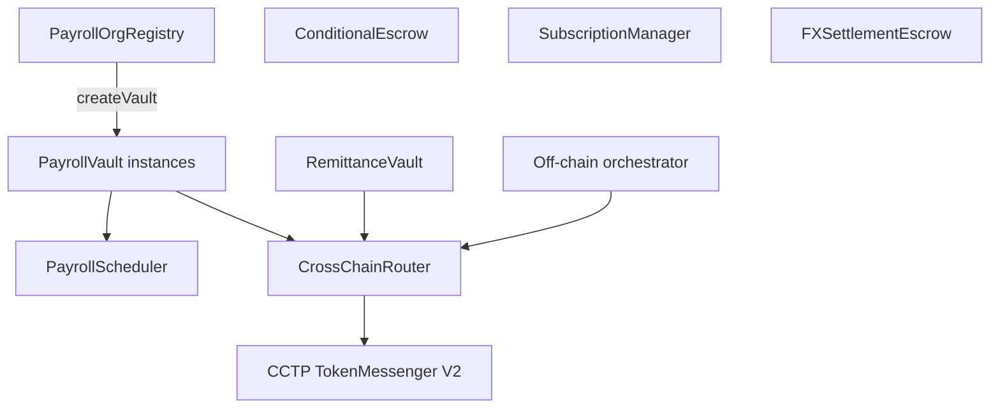

Payroll uses a **factory pattern** — one registry deploys many vaults. Remittance, escrow, and subscriptions are standalone contracts. CrossChainRouter is the shared hub for any vault that needs CCTP or Gateway routing.

---

### PayrollOrgRegistry

**Address:** [0x729a51BB90A72f628225Ca6a7583be51C7D5a2E5](https://testnet.arcscan.app/address/0x729a51BB90A72f628225Ca6a7583be51C7D5a2E5)  
**Source:** [PayrollOrgRegistry.sol](contracts/PayrollOrgRegistry.sol)

PayrollOrgRegistry is the **entry point for payroll**. Employers call `createOrganization(name)` to register an on-chain org, then `createVault(orgId)` to factory-deploy a dedicated PayrollVault. The registry stores an `Organization` struct per org: name, creator address, vault address, creation timestamp, and whether a vault has been deployed.

The critical design choice is **org isolation** — each organisation gets its own vault contract with its own employee roster and USDC balance. When `createVault` runs, it instantiates a new [PayrollVault.sol](contracts/PayrollVault.sol), transfers ownership to the org creator, and calls `CrossChainRouter.authorizeVault(vaultAddr, true)` so the new vault can route cross-chain payments. One creator can own multiple orgs via `_creatorOrgIds` mapping.

The app interacts with this contract through [usePayrollOrgRegistry.ts](frontend/hooks/usePayrollOrgRegistry.ts) and [PayrollOrgPanel.tsx](frontend/components/PayrollOrgPanel.tsx).

---

### PayrollVault (per-org, factory-deployed)

**Source:** [PayrollVault.sol](contracts/PayrollVault.sol) — address varies per org (deployed by registry)

PayrollVault is the **core payroll engine**. Each instance is owned by an employer and holds USDC for salary disbursement. Key responsibilities:

- **`deposit(token, amount)`** — employer funds the vault via ERC-20 transferFrom
- **`registerEmployee(...)`** — adds an employee with salary, pay interval, approved cap, destination chain, routing method, and transfer speed
- **`runPayroll()`** — queries PayrollScheduler for due employees, then pays each one

The `Employee` struct stores everything needed for a payout: wallet, salary, token, interval, nextPaymentDue, approvedCap, destinationChainId, routingMethod, transferSpeed, and active flag.

Inside `runPayroll()`, the vault builds arrays of active employees, calls `PayrollScheduler.computePayroll()` to filter due employees within caps, then for each due employee either:
- **`destinationChainId == 0`** — direct `IERC20.transfer` on Arc (local payout)
- **`destinationChainId > 0`** — approve USDC to CrossChainRouter and call `routeCCTP` or `routeGateway`

Cross-chain CCTP payouts emit `RouteCCTP` events that the off-chain orchestrator ([cross-chain-orchestrator.ts](circle/src/cross-chain-orchestrator.ts)) picks up to complete Bridge Kit burn/mint on the destination chain.

---

### PayrollScheduler

**Address:** [0x4292f03Db3716A5Ed44974DD3e5564f26b8359C1](https://testnet.arcscan.app/address/0x4292f03Db3716A5Ed44974DD3e5564f26b8359C1)  
**Source:** [PayrollScheduler.sol](contracts/PayrollScheduler.sol)

PayrollScheduler is intentionally **minimal and stateless**. It exposes one pure function — `computePayroll(employees, salaries, nextPaymentDue, approvedCaps, timestamp)` — that returns which employees are due for payment. An employee is due when `nextPaymentDue <= currentTimestamp` and `salary <= approvedCap`.

There is no storage, no admin key, and no token access. This separation keeps scheduling logic auditable and upgradeable independently of vault balances. The scheduler cannot move funds — it only answers "who should be paid right now?"

---

### CrossChainRouter

**Address:** [0xd582C4173aff5c04F64EAD42c4E12f3e5f93595d](https://testnet.arcscan.app/address/0xd582C4173aff5c04F64EAD42c4E12f3e5f93595d)  
**Source:** [CrossChainRouter.sol](contracts/CrossChainRouter.sol)

CrossChainRouter is the **shared cross-chain hub** for PayrollVault and RemittanceVault. Authorized vaults call it to route USDC to other chains via two methods:

- **`routeCCTP(token, amount, destinationDomain, recipient)`** — point-to-point CCTP burn via TokenMessenger V2. Emits `RouteCCTP` with a nonce for off-chain Bridge Kit completion.
- **`routeGateway(token, amount, destinationDomain, recipient)`** — records a Gateway payout request. Emits `GatewayPayoutRequested`. Off-chain orchestrator deposits to unified balance and spends on destination, then calls `markGatewayFulfilled`.

Access control uses `authorizedVaults` mapping — only vaults registered by PayrollOrgRegistry (or manually authorized) can call routing functions. An `orchestrator` address can mark Gateway payouts fulfilled. CCTP uses `minFinalityThreshold: 1000` for fast transfers from Arc testnet.

This contract is the on-chain half of cross-chain payroll and remittance — the off-chain half is Bridge Kit / Unified Balance Kit in the `circle/` package.

---

### ConditionalEscrow

**Address:** [0xEe618c3E0855c820eD02F10A3bDA876991120e4b](https://testnet.arcscan.app/address/0xEe618c3E0855c820eD02F10A3bDA876991120e4b)  
**Source:** [ConditionalEscrow.sol](contracts/ConditionalEscrow.sol)

ConditionalEscrow implements **milestone-based conditional payments**. A payer locks USDC (or EURC) by calling `createMilestone(payee, token, amount, approvers[], approvalsRequired, disputeDeadline)`. Funds sit in the contract until enough approvers call `approveMilestone(id)` — when `approvalCount >= approvalsRequired`, the contract auto-transfers to the payee.

If approvers never release, the payer can call `reclaimExpired(id)` after `disputeDeadline` passes. The approver list is immutable after creation. ReentrancyGuard protects all state changes. Double-approval is prevented via a per-milestone `hasApproved` mapping.

This contract encodes freelance/marketplace escrow rules entirely on-chain — no admin can override release or reclaim decisions.

---

### SubscriptionManager

**Address:** [0x2cC1fF23af1CFD0531AC568B7cAC709De1aE6de0](https://testnet.arcscan.app/address/0x2cC1fF23af1CFD0531AC568B7cAC709De1aE6de0)  
**Source:** [SubscriptionManager.sol](contracts/SubscriptionManager.sol)

SubscriptionManager handles **recurring billing with subscriber-controlled caps**. Providers create plans (`createPlan`) specifying token, charge amount, interval, max charges, and expiry. Subscribers opt in via `subscribe(planId, approvedCap)` after approving USDC to the contract.

The public `charge(subscriptionId)` function can be called by anyone when a subscription is due — it executes `transferFrom(subscriber, provider, chargeAmount)` and advances `nextChargeDue`. The subscriber's `approvedCap` is a hard ceiling: if `totalCharged + chargeAmount > approvedCap`, the charge reverts.

Subscribers can `revoke()` at any time. Providers can `deactivatePlan()`. This design makes subscriptions cron-friendly and keeper-friendly — no privileged billing backend required.

---

### RemittanceVault

**Address:** [0x1A3c1901449C8aEF0c5e23a68d68F910EE607875](https://testnet.arcscan.app/address/0x1A3c1901449C8aEF0c5e23a68d68F910EE607875)  
**Source:** [RemittanceVault.sol](contracts/RemittanceVault.sol)

RemittanceVault supports **one-off on-chain remittance sends** — an alternative to the Circle Wallets Path A flow. Senders call `sendRemittance(recipient, amount, destinationChainId, routingMethod, attestationHash)` which deducts a protocol fee (`feeBps`, default configurable) to a treasury address and routes the remainder via CrossChainRouter for cross-chain delivery or direct transfer for Arc-local.

Each remittance is stored in a `Remittance` struct with sender, recipient, amount, fee, destination, routing method, attestation hash, and completion flag. This contract is used in integration tests and as a programmatic send primitive; the primary consumer remittance UI uses Circle Wallets (Path A) instead.

---

### FXSettlementEscrow

**Address:** [0xE02800F2BEAC8675EbBd7d23F795C62288085987](https://testnet.arcscan.app/address/0xE02800F2BEAC8675EbBd7d23F795C62288085987)  
**Source:** [FXSettlementEscrow.sol](contracts/FXSettlementEscrow.sol)

FXSettlementEscrow is a **thin payment-vs-payment (PvP) registry** — it does not custody USDC. When a remittance involves a StableFX trade, the off-chain orchestrator calls `open(remittanceRef, stableFxTradeId, payer, usdcAmount)` to record both legs. As the FX trade and payout complete, the orchestrator calls `confirmFxOnChain()` and `confirmPayoutOnChain()` with respective tx hashes.

This enables auditable linking between a StableFX conversion and a remittance payout without the contract holding funds. Circle's FxEscrow + Permit2 handle the actual FX settlement on-chain; this contract is the coordination ledger.

---

### Tokens and CCTP infrastructure

| Token | Address | Decimals |
|-------|---------|----------|
| USDC (native on Arc) | [0x3600...0000](https://testnet.arcscan.app/address/0x3600000000000000000000000000000000000000) | 6 |
| EURC | [0x89B5...D72a](https://testnet.arcscan.app/address/0x89B50855Aa3bE2F677cD6303Cec089B5F319D72a) | 6 |

| Item | Value |
|------|-------|
| CCTP TokenMessenger V2 | [0x8FE6...2DAA](https://testnet.arcscan.app/address/0x8FE6B999Dc680CcFDD5Bf7EB0974218be2542DAA) |
| Arc CCTP domain | `26` |

### CCTP destination domain mapping

| Domain | Chain ID | Label | Bridge Kit name |
|--------|----------|-------|-----------------|
| `0` | `5042002` | Arc (local) | `Arc_Testnet` |
| `1` | `43113` | Avalanche Fuji | `Avalanche_Fuji` |
| `3` | `421614` | Arbitrum Sepolia | `Arbitrum_Sepolia` |
| `6` | `84532` | Base Sepolia | `Base_Sepolia` |

Source: [cctp-domains.ts](config/cctp-domains.ts)

### Interface contracts

- [IERC20.sol](contracts/interfaces/IERC20.sol) — token transfer interface
- [ICrossChainRouter.sol](contracts/interfaces/ICrossChainRouter.sol) — router interface for vaults
- [IPayrollScheduler.sol](contracts/interfaces/IPayrollScheduler.sol) — scheduler interface
- [ITokenMessengerV2.sol](contracts/interfaces/ITokenMessengerV2.sol) — CCTP TokenMessenger interface

---

## Feedback for Circle Team

We built Arcittance to exercise the full Circle + Arc stack end-to-end. Most products worked excellently in sandbox. One critical rail blocked our Path B bank remittance demo.

### Issue summary

**Sandbox wire-bank create is broken.**

```
POST https://api-sandbox.circle.com/v1/businessAccount/banks/wires
→ HTTP 500
→ Internal service: eft-sandbox-eft (retries exhausted)
```

This is not a client-side validation error (4xx). Auth, Mint balances, Payins, Payouts, StableFX, User Wallets, Bridge Kit, and Gateway all worked with the same API key.

### Reproduction

Run from this repository (requires `CIRCLE_MINT_API_KEY` in `.env`):

```bash
npm run test:mint-wire-variants
```

The script tests:
- Fresh UUID idempotency keys
- Circle-documented sandbox ABA/routing (`12340010` / `121000248`)
- Mint path (`/v1/businessAccount/banks/wires`) vs legacy (`/v1/banks/wires`)

All variants return the same 500 + `eft-sandbox-eft` pattern.

### Business impact

Path B's intended demo flow was:

```
sender bank wire → Mint fiat credit → mint USDC → ledger → Payouts to recipient
```

We could not complete the first step. Without wire-bank link:
- No wire instructions
- No mock wire deposit
- No fiat-on-ramp credit to Mint

We built **Path B · Bank-mock** as a workaround: fake AED bank UX + treasury Payins top-up + same Payouts delivery path. This demonstrates the corridor concept but is not a substitute for validating the real wire rail.

### What we need from Circle

1. **Fix or restore** sandbox `POST /v1/businessAccount/banks/wires` (eft-sandbox-eft service)
2. Or provide a **documented alternative** to simulate Mint fiat credit in sandbox (e.g. direct sandbox deposit API that doesn't require wire-bank create)
3. Clarify whether this is a known sandbox outage or environment-specific issue

### What worked well (thank you)

| Product | Our experience |
|---------|----------------|
| Arc L1 + native USDC gas | Seamless — no wrapped tokens |
| User Wallets (W3S) | Sign-in, embedded wallet, transfer challenges all solid |
| Developer Controlled Wallets + Gas Station | Keeper payroll and subscription charges worked |
| StableFX | Live sandbox quotes and Permit2 settle worked |
| Bridge Kit (CCTP) | Cross-chain payroll and remittance burns/mints worked |
| Gateway (Unified Balance) | Deposit + spend path worked |
| Payins | B_MOCK top-up via crypto deposit worked reliably |
| Payouts | Multi-chain USDC delivery to registered addresses worked (verified Base, etc.) |

We want Path B's wire rail to work as documented so we can demo the full fiat-on-ramp story without the mock workaround.

---

## How to Setup the Project

This section is a **standalone clone-to-run guide**. Follow it to run Arcittance locally.

### Prerequisites

| Requirement | Version / Notes |
|-------------|-----------------|
| Node.js | `>= 22` (see `frontend/package.json` engines) |
| npm | Bundled with Node |
| Git | Any recent version |
| MetaMask (or compatible wallet) | Payroll, escrow, subscriptions on-chain txs |
| Circle Developer Console | [console.circle.com](https://console.circle.com) — sandbox API keys |
| Supabase project | Free tier OK — remittance metadata, mint ledger, FX quotes |
| Arc Testnet USDC | [faucet.circle.com](https://faucet.circle.com) → Arc Testnet |

Optional:
- `pg` + `@types/pg` at repo root for automated DB migrations
- Hardhat for contract compile/deploy

### Clone and Install

```bash
git clone https://github.com/Marshal-AM/arcittance.git
cd arcittance

# Root — Hardhat, scripts, shared deps
npm install

# Circle SDK package (used by frontend API routes)
cd circle && npm install --legacy-peer-deps && cd ..

# Database layer
cd db && npm install --legacy-peer-deps && cd ..

# Next.js frontend
cd frontend && npm install --legacy-peer-deps && cd ..
```

This matches the Vercel build install order in `frontend/vercel.json`.

### Environment Variables

Two env files are required.

#### Root `.env`

Copy from [`.env.example`](.env.example):

```bash
cp .env.example .env
```

Key groups:

| Group | Variables |
|-------|-----------|
| Network | `ARC_RPC_URL`, `ARC_CHAIN_ID=5042002`, `ARC_NETWORK=arc:testnet` |
| Personas (7 keys) | `DEPLOYER_PRIVATE_KEY`, `KEEPER_PRIVATE_KEY`, `TREASURY_PRIVATE_KEY`, `FACILITATOR_PRIVATE_KEY`, `EMPLOYER_DEMO_PRIVATE_KEY`, `REMIT_SENDER_DEMO_PRIVATE_KEY`, `RECIPIENT_DEMO_PRIVATE_KEY` |
| Circle server | `CIRCLE_API_KEY`, `CIRCLE_WALLETS_ENTITY_SECRET`, `CIRCLE_STABLEFX_API_KEY`, `CIRCLE_MINT_API_KEY`, `CIRCLE_FACILITATOR_WALLET_ID`, `CIRCLE_WALLETS_APP_ID`, `CIRCLE_CCTP_BRIDGEKIT_CONFIG` |
| Supabase | `SUPABASE_URL`, `SUPABASE_SERVICE_ROLE_KEY` |
| Contracts | `NEXT_PUBLIC_PAYROLL_ORG_REGISTRY_ADDRESS`, etc. (from `deployments/arc/addresses.json`) |

#### Frontend `frontend/.env.local`

Copy from [`frontend/.env.example`](frontend/.env.example):

```bash
cp frontend/.env.example frontend/.env.local
```

Sync all `NEXT_PUBLIC_*` contract addresses from `deployments/arc/addresses.json`.

Server-only keys in root `.env` are loaded by API routes via `loadServerEnv()` in [`frontend/lib/server/env.ts`](frontend/lib/server/env.ts) — which reads the parent directory `.env`.

#### Minimal vs full configuration

| Profile | Required env | Features enabled |
|---------|--------------|------------------|
| **Minimal** | Arc RPC, contract addresses, one wallet private key | Payroll, milestones, subscriptions (wallet mode) |
| **Remit Path A** | + Circle User Wallets app ID, API keys, facilitator keys | Crypto remittance, StableFX, CCTP, Gateway |
| **Remit B_MOCK** | + `TREASURY_PRIVATE_KEY` funded with Arc USDC, Mint/Payins keys | AED corridor mock demo |
| **Remit Path B** | + Mint keys, allowlisted facilitator | Wire rail (**blocked in sandbox** — see Feedback) |
| **Keeper mode** | + `CIRCLE_FACILITATOR_WALLET_ID`, `NEXT_PUBLIC_USE_CIRCLE_KEEPER=true` | Gasless payroll / subscription charge (not milestones) |

### Wallet Provisioning and Faucet

1. Generate 7 separate Ethereum wallets
2. Paste private keys into root `.env`
3. Run:

```bash
npm run provision:accounts
```

This writes public addresses to `config/accounts.testnet.json`.

4. Fund via [faucet.circle.com](https://faucet.circle.com) → **Arc Testnet** → USDC:

| Persona | Required? | Purpose |
|---------|-----------|---------|
| Deployer | Yes | Contract deploy (if redeploying) |
| Keeper | Yes | Keeper mode payroll |
| Facilitator | Yes | CCTP, StableFX, Gateway |
| Treasury | Yes for B_MOCK | Payins top-up |
| Employer demo | Optional | Payroll demos |
| Remit sender demo | Optional | Remittance demos |
| Recipient demo | Optional | Payout destination demos |

Gas on Arc is paid in **USDC**, not ETH.

### Circle Console Setup

1. Create account at [console.circle.com](https://console.circle.com)
2. **User Wallets:** create app → set `NEXT_PUBLIC_CIRCLE_APP_ID` + `CIRCLE_WALLETS_ENTITY_SECRET`
3. **Developer Wallets:** copy `CIRCLE_API_KEY` → run:

```bash
npm run configure:circle-wallets
```

Set returned `CIRCLE_FACILITATOR_WALLET_ID` in `.env` → fund with faucet USDC.

4. **StableFX / Mint:** enable StableFX sandbox → `CIRCLE_STABLEFX_API_KEY` (often same as `CIRCLE_MINT_API_KEY`)
5. **Bridge Kit:** `CIRCLE_CCTP_BRIDGEKIT_CONFIG={"arcDomain":26}`
6. **Gateway (optional):** `CIRCLE_GATEWAY_API_KEY`
7. **Mint allowlist:** add facilitator EOA address in Mint Console (needed for Path B mint, even though wire create is broken)

### Contract Addresses

#### Option A — Use pre-deployed (fastest)

Copy from [`deployments/arc/addresses.json`](deployments/arc/addresses.json) into both `.env` and `frontend/.env.local`:

| Env variable | Contract |
|--------------|----------|
| `NEXT_PUBLIC_PAYROLL_ORG_REGISTRY_ADDRESS` | PayrollOrgRegistry |
| `NEXT_PUBLIC_CONDITIONAL_ESCROW_ADDRESS` | ConditionalEscrow |
| `NEXT_PUBLIC_SUBSCRIPTION_MANAGER_ADDRESS` | SubscriptionManager |
| `NEXT_PUBLIC_REMITTANCE_VAULT_ADDRESS` | RemittanceVault |
| `NEXT_PUBLIC_CROSS_CHAIN_ROUTER_ADDRESS` | CrossChainRouter |
| `NEXT_PUBLIC_FX_SETTLEMENT_ESCROW_ADDRESS` | FXSettlementEscrow |

#### Option B — Deploy fresh

```bash
# Ensure DEPLOYER_PRIVATE_KEY is funded with Arc USDC
npm run compile
npm run deploy:arc
# Writes deployments/arc/addresses.json — sync to .env files
```

### Supabase and Database Migrations

1. Create Supabase project
2. Copy `SUPABASE_URL` + `SUPABASE_SERVICE_ROLE_KEY` to `.env`
3. Run migrations:

```bash
npm run db:migrate
```

Two paths (from `scripts/db-migrate.ts`):

| Method | Setup | Action |
|--------|-------|--------|
| **Automated** | Set `SUPABASE_DB_URL` (direct Postgres connection string) + install `pg` | Script applies all SQL |
| **Manual** | Only URL + service role key | Script prints SQL → paste in Supabase Dashboard → SQL Editor |

Migration files:

| File | Enables |
|------|---------|
| `001_initial.sql` | Remittances, receipts, compliance tables |
| `002_fx_quotes_phase10.sql` | StableFX quote persistence |
| `003_remit_payins_payouts.sql` | Payins and payouts audit trail |
| `004_mint_ledger_path_b.sql` | Mint ledger for Path B / B_MOCK |
| `005_milestone_subscription_metadata.sql` | Off-chain title/description for milestones and plans |

**Without Supabase:** payroll, escrow, and subscriptions work on-chain. Remittance tracking, receipts, metadata, and mint ledger will fail.

### Run the Frontend

```bash
cd frontend
npm run dev
```

| URL | Page |
|-----|------|
| `http://localhost:3000` | Landing page |
| `http://localhost:3000/app` | App shell |
| `http://localhost:3000/payroll` | Payroll |
| `http://localhost:3000/escrow` | Milestones |
| `http://localhost:3000/subscriptions` | Subscriptions |
| `http://localhost:3000/remit` | Remittance |

#### MetaMask — Arc Testnet

| Field | Value |
|-------|-------|
| Network name | Arc Testnet |
| RPC URL | `https://rpc.testnet.arc.io` |
| Chain ID | `5042002` |
| Currency symbol | USDC |
| Block explorer | `https://testnet.arcscan.app` |

Production build:

```bash
cd frontend && npm run build && npm start
```

### Optional — Deploy and Configure Scripts

| Command | Purpose |
|---------|---------|
| `npm run compile` | Compile Solidity contracts |
| `npm run deploy:arc` | Deploy all contracts to Arc testnet |
| `npm run configure:circle-wallets` | Create/verify facilitator developer wallet |
| `npm run configure:cross-chain` | Configure CrossChainRouter after deploy |
| `npm run db:migrate` | Apply Supabase migrations |
| `npm run arc:smoke` | Basic Arc connectivity smoke test |
| `npm run verify:live` | End-to-end live verification |

### Verify Your Setup

- [ ] `npm run arc:smoke` passes
- [ ] Frontend loads at `localhost:3000/app` without env errors
- [ ] MetaMask connects to Arc testnet
- [ ] Payroll: create org → deploy vault → deposit USDC → register employee
- [ ] Escrow: create milestone (USDC approve + tx)
- [ ] Subscriptions: create plan + subscribe
- [ ] Remit Path A: Circle sign-in → wallet balance loads
- [ ] Remit B_MOCK: fund with AED mock → payout completes
- [ ] `npm run test:circle` — Circle package unit tests pass

Probe scripts for Path B wire debugging:

```bash
npm run test:mint-wire-variants
npm run test:bank-mock-fund
```

### Feature-Specific Requirements

| Feature | Minimum requirements |
|---------|---------------------|
| Payroll (local) | MetaMask + USDC on Arc + contract addresses |
| Payroll (cross-chain) | + facilitator keys + Bridge Kit config |
| Payroll (keeper) | + `CIRCLE_FACILITATOR_WALLET_ID` + keeper key |
| Milestones | MetaMask + USDC + escrow address |
| Subscriptions | MetaMask + USDC + subscription manager address |
| Remit Path A | Circle W3S app + all Circle API keys + Supabase |
| Remit B_MOCK | Path A keys + funded `TREASURY_PRIVATE_KEY` |
| Remit Path B | Mint keys + allowlisted facilitator (**wire API broken**) |

### Troubleshooting

| Symptom | Fix |
|---------|-----|
| `Missing env var: NEXT_PUBLIC_PAYROLL_ORG_REGISTRY_ADDRESS` | Copy addresses from `deployments/arc/addresses.json` |
| Circle sign-in fails | Check `NEXT_PUBLIC_CIRCLE_APP_ID` + `CIRCLE_WALLETS_ENTITY_SECRET` |
| B_MOCK fund fails | Fund treasury EOA with Arc USDC; verify `TREASURY_PRIVATE_KEY` |
| StableFX quote fails | Verify `CIRCLE_STABLEFX_API_KEY` and sandbox StableFX access |
| Path B wire returns 500 | Expected sandbox outage — use B_MOCK ([Feedback](#feedback-for-circle-team)) |
| Supabase errors on remit | Run `db:migrate` or check service role key |
| Cross-chain payroll stuck | Call `/api/cross-chain/orchestrate` after `runPayroll` tx confirms |
| Gateway send fails | Verify facilitator SCA funded; check `CIRCLE_GATEWAY_API_KEY` |

---

## Roadmap

Arcittance is demo-ready on Arc testnet. The items below are a realistic next phase — building on what already works rather than replacing the core architecture.

### Near term (testnet → production readiness)

- **Mainnet deployment** — Redeploy and verify contracts on Arc mainnet; pin addresses, run full smoke and live verification suites.
- **Path B wire rail** — Swap B_MOCK for real Mint wire on-ramp once Circle restores sandbox `POST /v1/businessAccount/banks/wires` (see [Feedback for Circle Team](#feedback-for-circle-team)).
- **Keeper mode hardening** — Gate all batch-charge UI behind `NEXT_PUBLIC_USE_CIRCLE_KEEPER`; add server-side env checks on keeper API routes; document Gas Station policy setup in Circle Console.

### Integrations and scale

- **More CCTP / Gateway destinations** — Extend `CrossChainRouter` and remittance routing.
- **EURC cross-chain** — Enable EURC delivery via CCTP/Gateway when Circle supports it (today EURC is Arc-local only).

---

## Conclusion

Arcittance set out to prove that a single stack on Circle's Arc L1 could replace the fragmented tooling that still governs global money movement — and on testnet, it largely does. Four on-chain primitives share one settlement layer: employers run **payroll** through factory-deployed vaults; freelancers lock funds in **milestone escrow** with N-of-M approver release; SaaS and marketplaces bill via **subscriptions** with subscriber-controlled spending caps; and consumers send **remittance** over crypto-native, bank-intent, or AED mock-bank rails. All of it settles in native USDC and EURC, with gas paid in USDC and no wrapped tokens.

What makes this more than a contract demo is the depth of Circle integration. **User Wallets** power Path A sign-in and embedded-wallet sends. **StableFX** provides live USDC↔EURC quotes with on-chain settlement. **Bridge Kit** and **Gateway** complete cross-chain payroll and remittance to Avalanche, Arbitrum, and Base. **Payins** and **Payouts** drive the AED corridor and crypto delivery legs. **Developer Controlled Wallets** with Gas Station sponsorship enable optional keeper-mode payroll and subscription charges — so operators can run those flows without every user holding Arc gas. Milestone create, approve, and reclaim always use the connected wallet so the on-chain payer can reclaim after a deadline. Off-chain orchestrators in `circle/src/` finish the legs that contracts cannot: CCTP burns, unified-balance spends, FX debits, and Payins settlement waits. Supabase persists remittance rows, FX quotes, mint ledger entries, and downloadable PDF receipts.

The remittance story is deliberately dual-rail. **Path A** is fully crypto-native: sign in, optionally convert via StableFX, send locally on Arc or cross-chain via CCTP/Gateway, track every leg, download a receipt. **Path B** is the fiat-on-ramp vision — sender bank wire → Mint credit → on-chain USDC → Payouts or fiat wire out — blocked today only at sandbox wire-bank create (`eft-sandbox-eft`). **Path B · Bank-mock** fills that gap honestly: AED sender bank → live FX → Payins top-up → Payouts delivery → recipient bank UX, reusing the same ledger and delivery stack Path B was designed for. We documented the sandbox failure in [Feedback for Circle Team](#feedback-for-circle-team) rather than hiding it.

For judges and developers reviewing this repo: the live app is at [arcittance.vercel.app](https://arcittance.vercel.app/). Contracts are deployed and verifiable on [Arcscan](https://testnet.arcscan.app). Suggested starting points — Path A remittance (Circle sign-in → cross-chain send), payroll (create org → fund vault → pay an employee), milestones (create → approve → release), or the B_MOCK AED corridor (Fund → auto-payout → Track). Each flow runs in minutes on testnet with a funded wallet. The codebase is a monorepo with a testable `circle/` SDK layer, Hardhat contracts, and a Next.js frontend — clone, configure env, and run locally using [How to Setup the Project](#how-to-setup-the-project).

Arc is not merely a chain that lists USDC — it is a settlement layer where payment rules, cross-chain routing, and FX can be composed in one application. Arcittance is our working proof on testnet. The [Roadmap](#roadmap) covers mainnet deployment, restoring Path B's wire rail, keeper hardening, and expanding chain and EURC support. The primitives, integrations, and architecture are built; what remains is production hardening and the fiat rails Circle already documents — once sandbox wire-bank create is restored.


